.. _aws_resources:

=============
AWS Resources
=============

aws_account
-----------

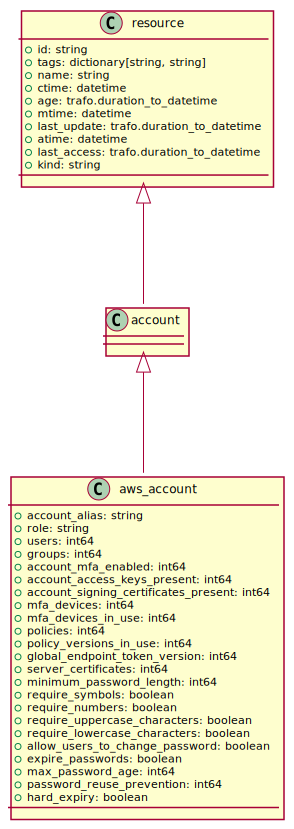

aws_alb
-------

aws_alb_quota
-------------

aws_alb_target_group
--------------------

.. image:: img/aws_alb_target_group.svg

aws_autoscaling_group
---------------------

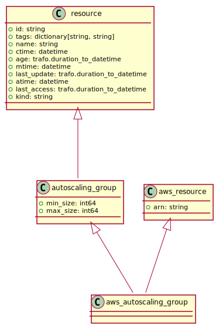

aws_cloudformation_stack
------------------------

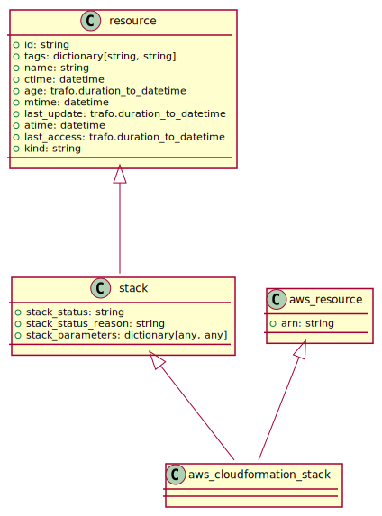

aws_cloudwatch_alarm
--------------------

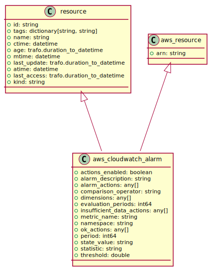

aws_ec2_elastic_ip
------------------

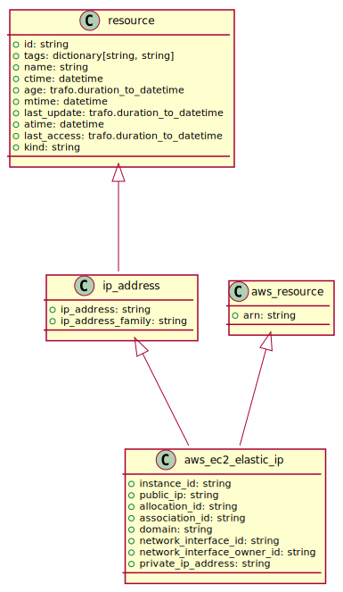

aws_ec2_instance
----------------

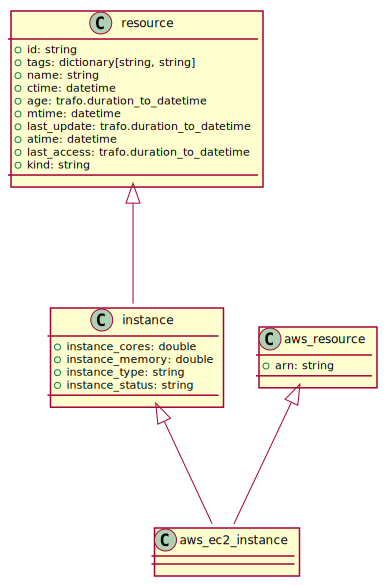

aws_ec2_instance_quota
----------------------

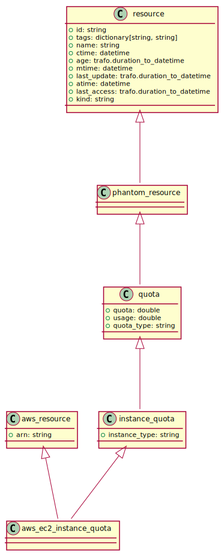

aws_ec2_instance_type
---------------------

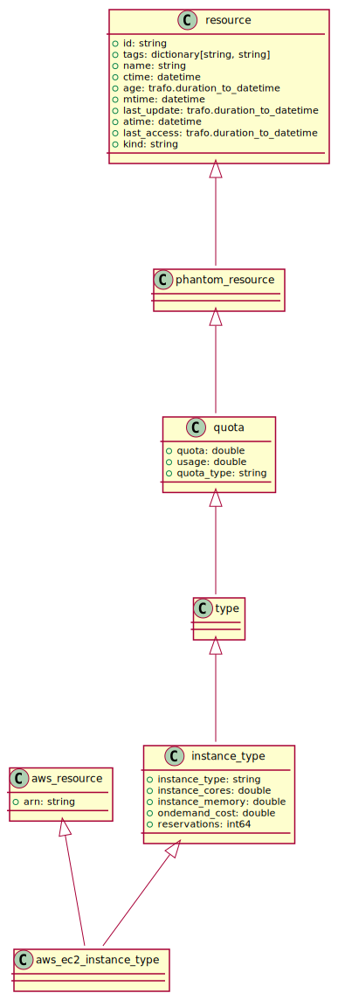

aws_ec2_internet_gateway
------------------------

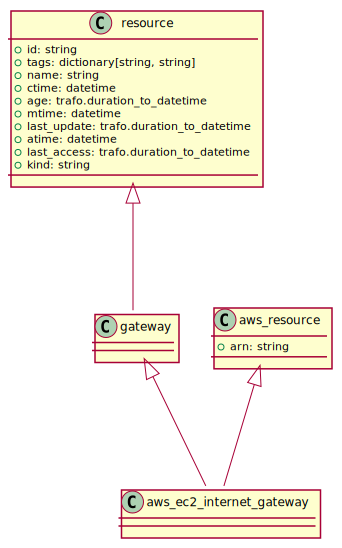

aws_ec2_internet_gateway_quota
------------------------------

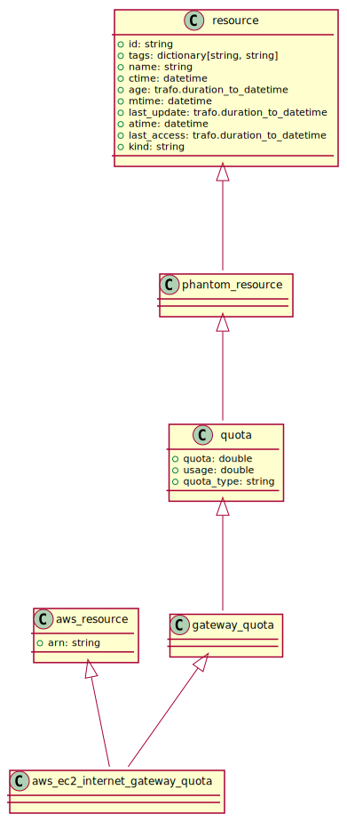

aws_ec2_keypair
---------------

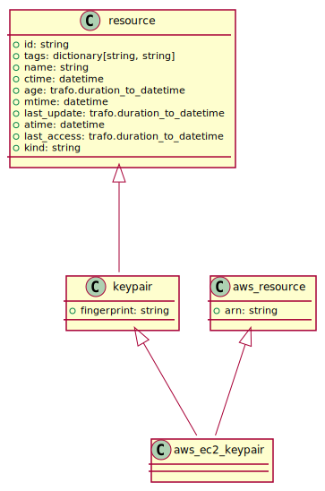

aws_ec2_nat_gateway
-------------------

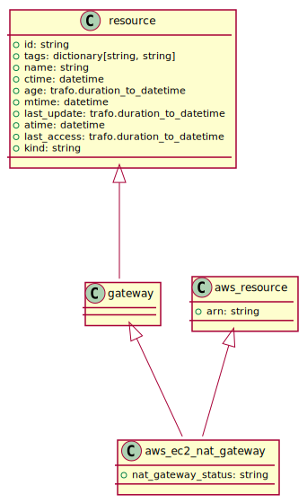

aws_ec2_network_acl
-------------------

.. image:: img/aws_ec2_network_acl.svg

aws_ec2_network_interface
-------------------------

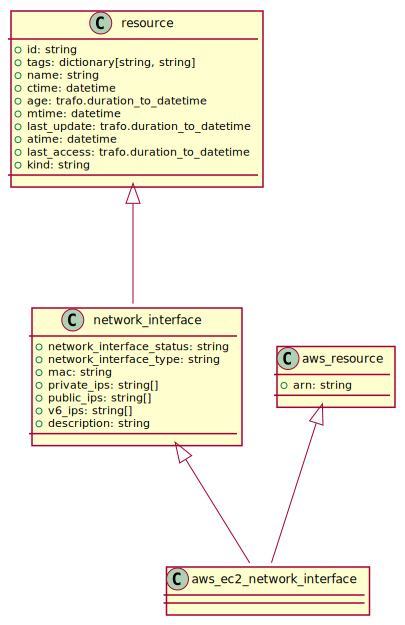

aws_ec2_route_table
-------------------

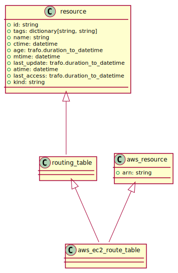

aws_ec2_security_group
----------------------

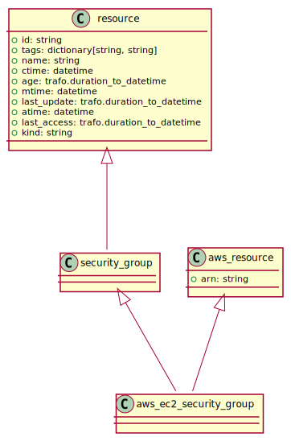

aws_ec2_snapshot
----------------

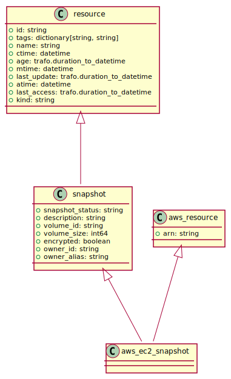

aws_ec2_subnet
--------------

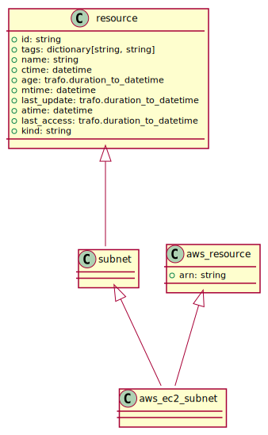

aws_ec2_volume
--------------

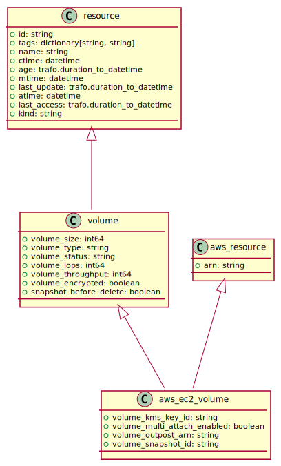

aws_ec2_volume_type
-------------------

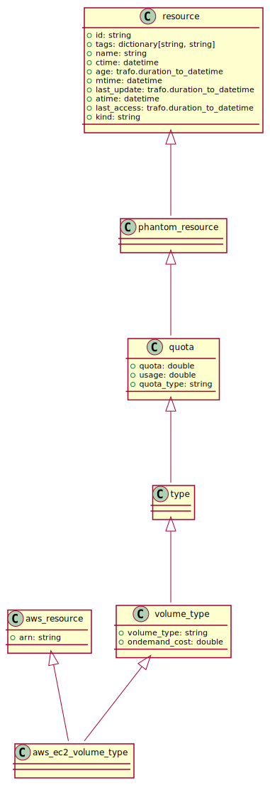

aws_eks_cluster
---------------

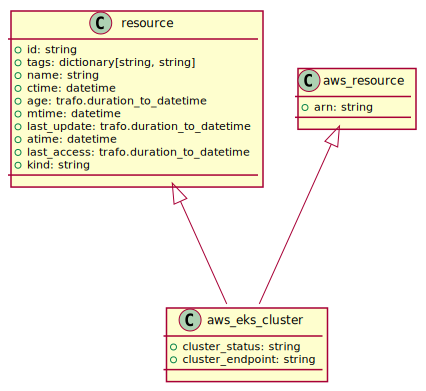

aws_eks_nodegroup
-----------------

aws_elb
-------

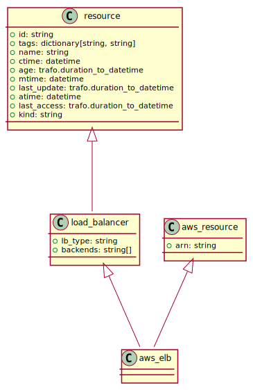

aws_elb_quota
-------------

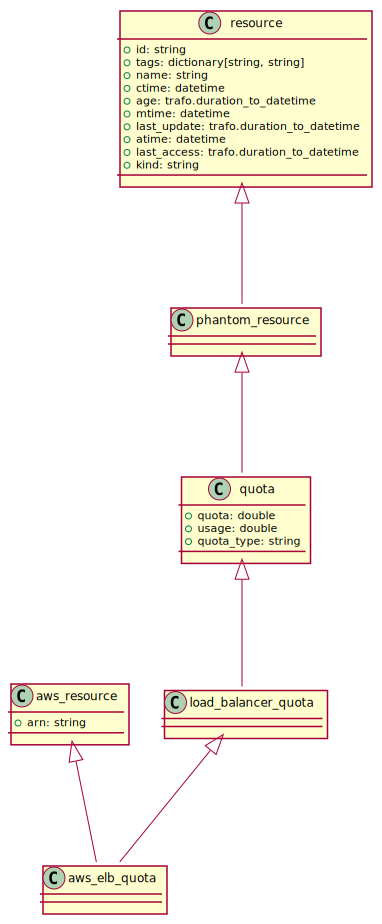

aws_iam_access_key
------------------

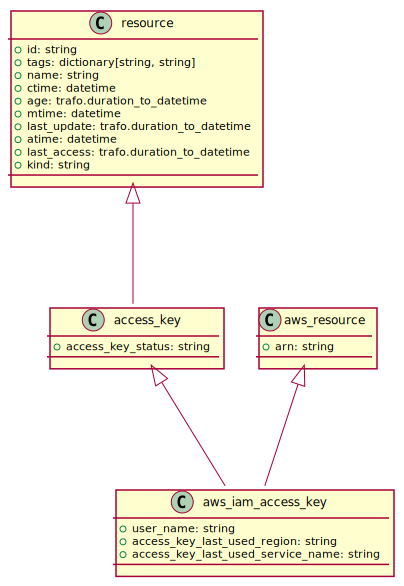

aws_iam_group
-------------

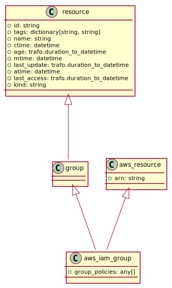

aws_iam_instance_profile
------------------------

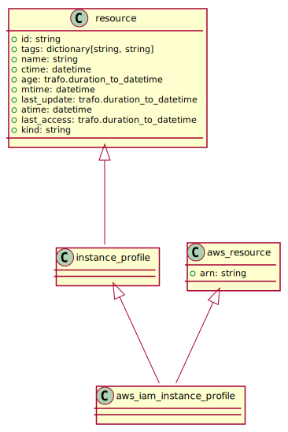

aws_iam_policy
--------------

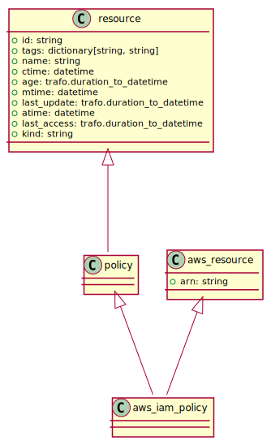

aws_iam_role
------------

aws_iam_server_certificate
--------------------------

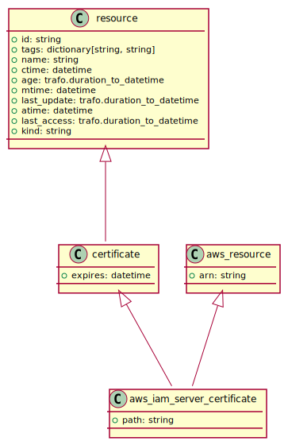

aws_iam_server_certificate_quota
--------------------------------

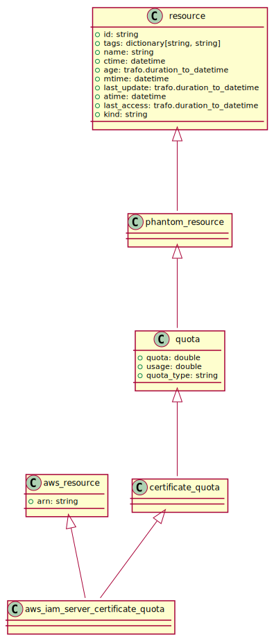

aws_iam_user
------------

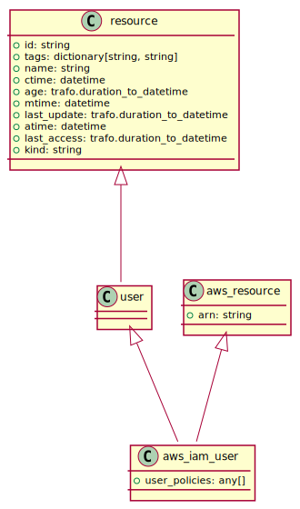

aws_rds_instance
----------------

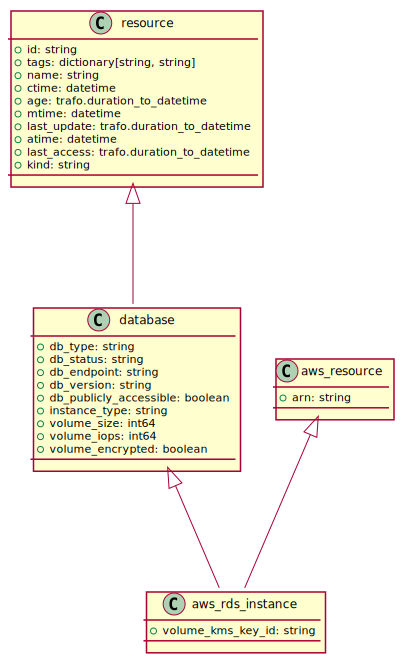

aws_region
----------

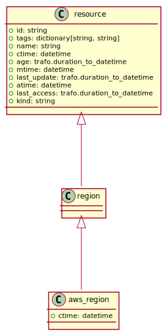

aws_resource
------------

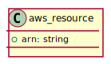

aws_s3_bucket
-------------

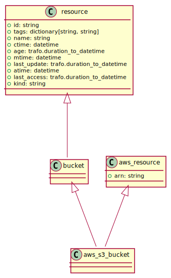

aws_s3_bucket_quota
-------------------

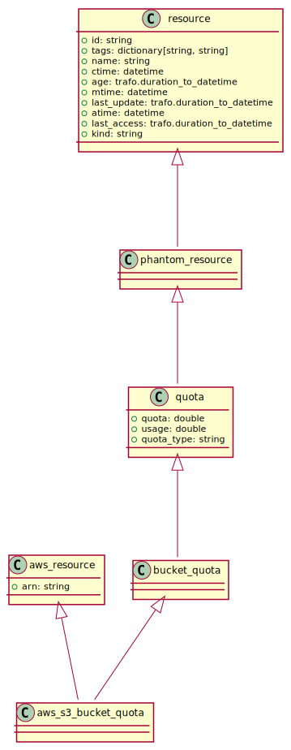

aws_vpc
-------

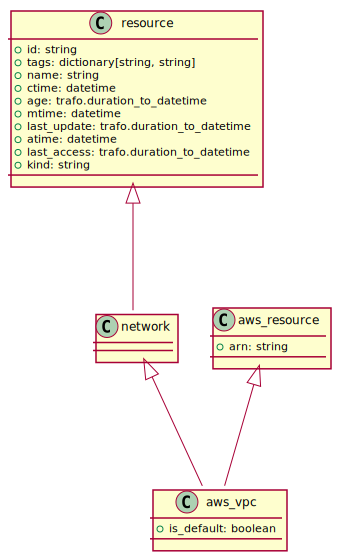

aws_vpc_endpoint
----------------

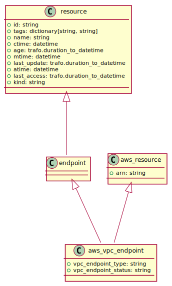

aws_vpc_peering_connection
--------------------------

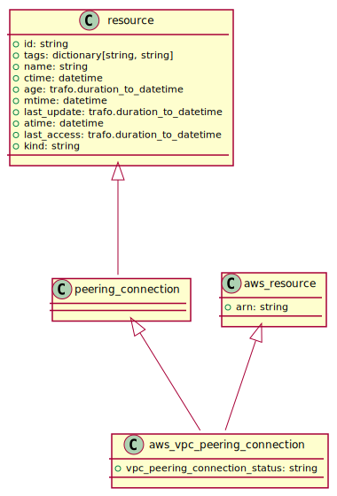

aws_vpc_quota
-------------

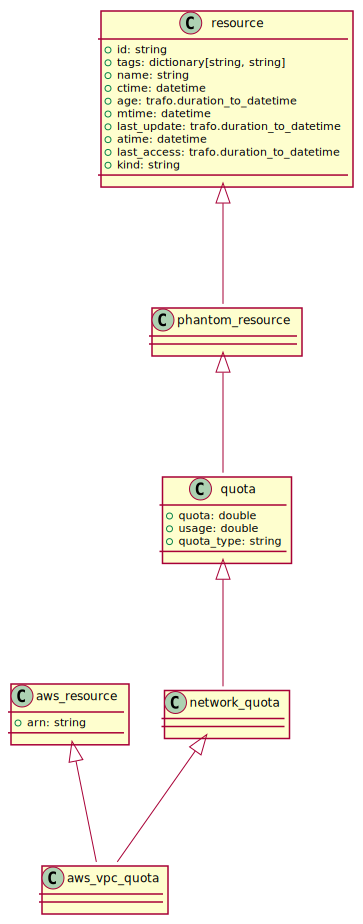

