.. _gcp_resources:

=============
GCP Resources
=============

gcp_autoscaler
--------------

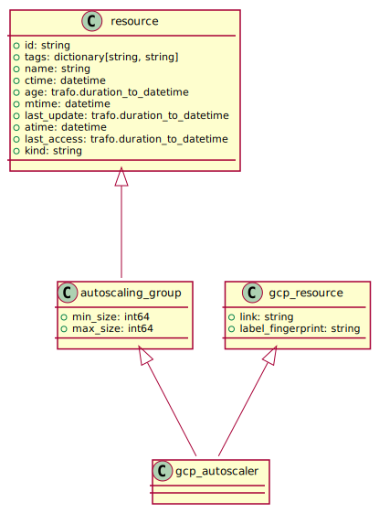

gcp_backend_service
-------------------

gcp_bucket
----------

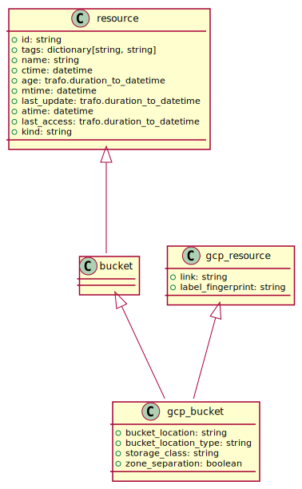

gcp_database
------------

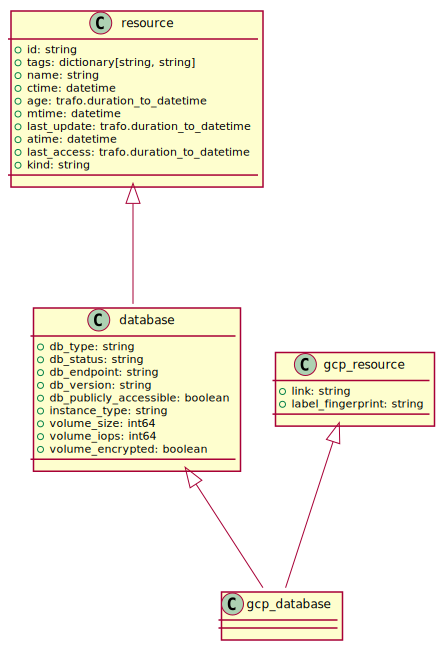

gcp_disk
--------

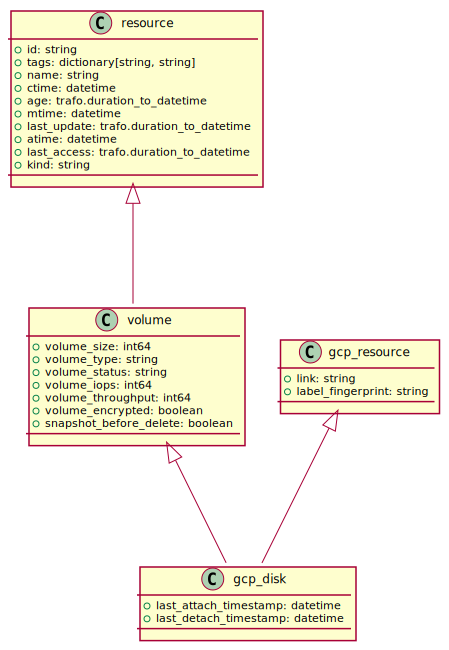

gcp_disk_type
-------------

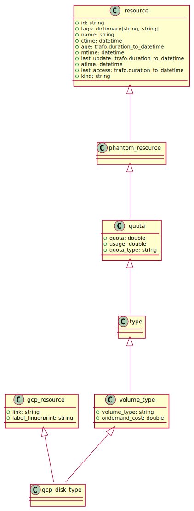

gcp_forwarding_rule
-------------------

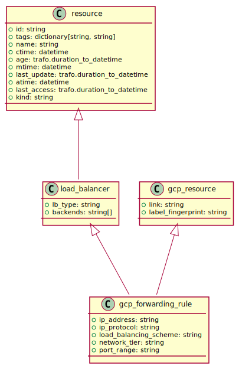

gcp_global_forwarding_rule
--------------------------

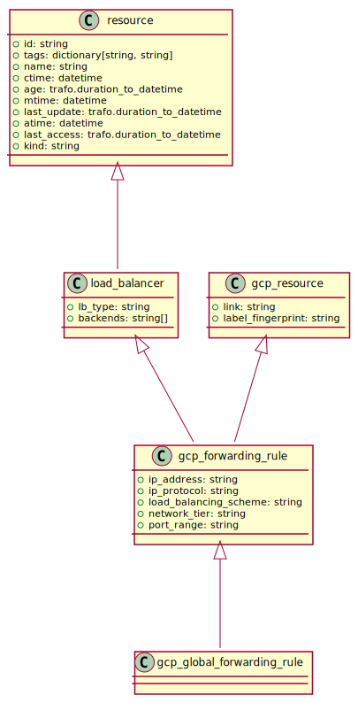

gcp_global_network_endpoint_group
---------------------------------

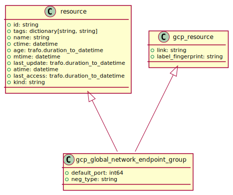

gcp_health_check
----------------

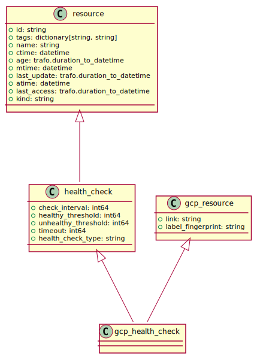

gcp_http_health_check
---------------------

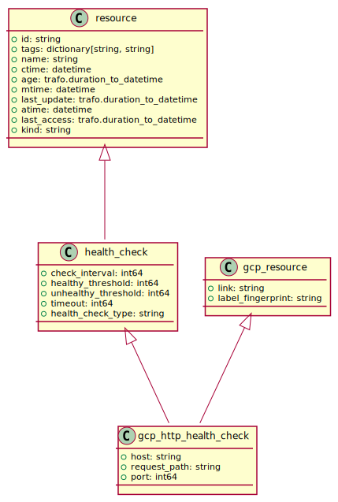

gcp_https_health_check
----------------------

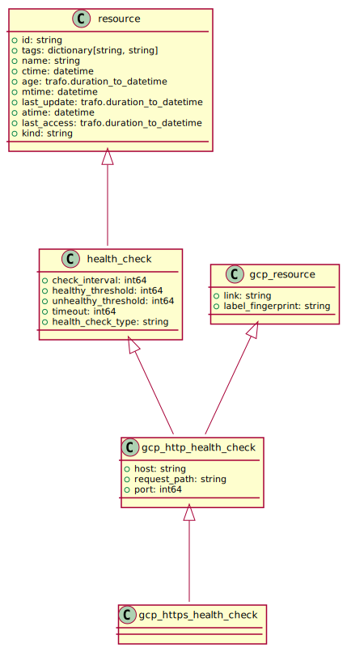

gcp_instance
------------

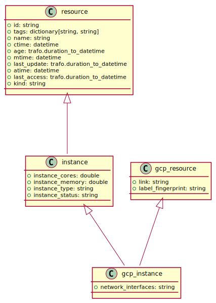

gcp_instance_group
------------------

gcp_instance_group_manager
--------------------------

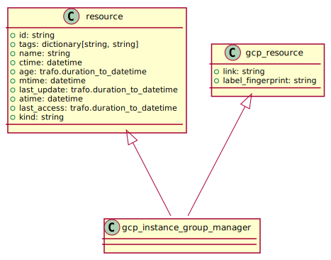

gcp_instance_template
---------------------

gcp_machine_type
----------------

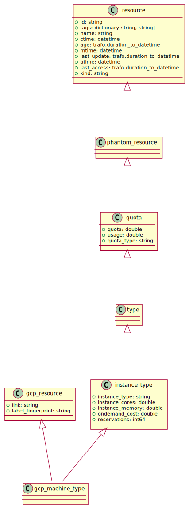

gcp_network
-----------

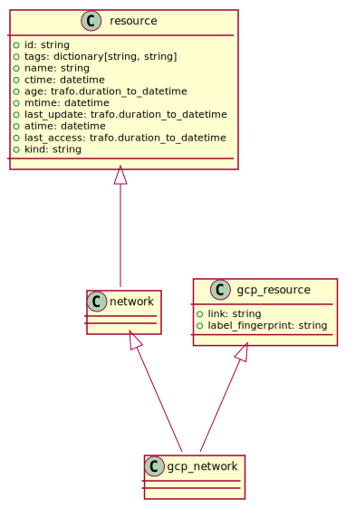

gcp_network_endpoint_group
--------------------------

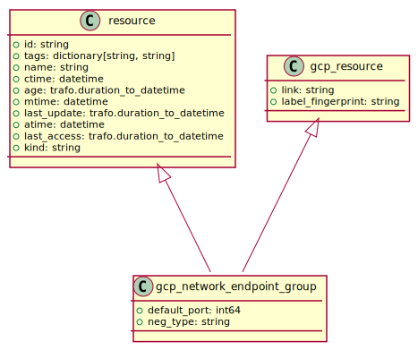

gcp_project
-----------

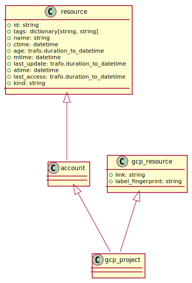

gcp_quota
---------

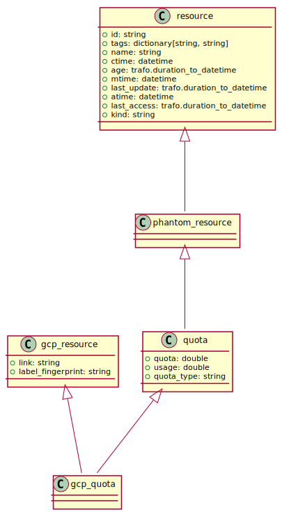

gcp_region
----------

.. image:: img/gcp_region.svg

gcp_resource
------------

.. image:: img/gcp_resource.svg

gcp_route
---------

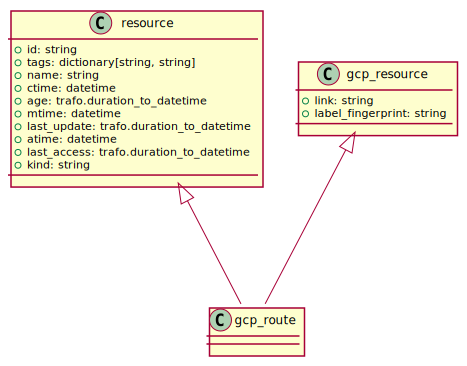

gcp_router
----------

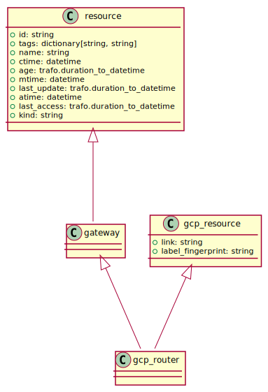

gcp_security_policy
-------------------

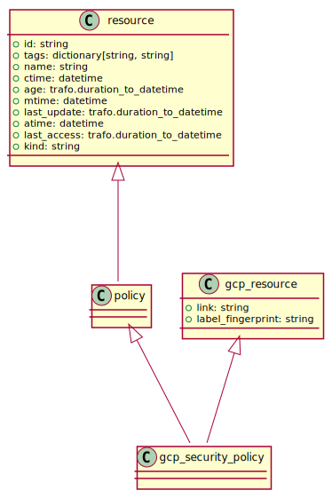

gcp_service
-----------

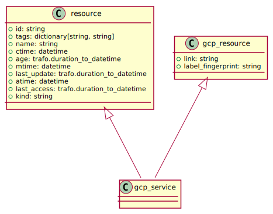

gcp_service_sku
---------------

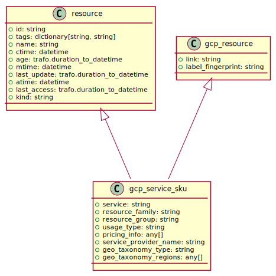

gcp_snapshot
------------

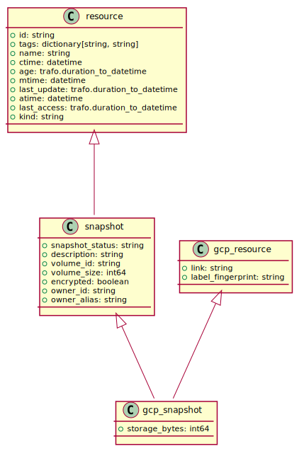

gcp_ssl_certificate
-------------------

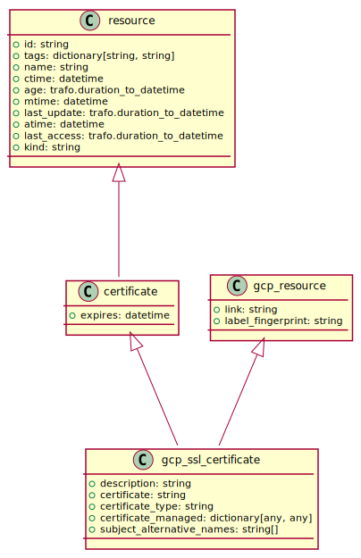

gcp_subnetwork
--------------

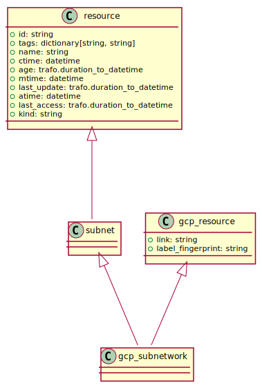

gcp_target_grpc_proxy
---------------------

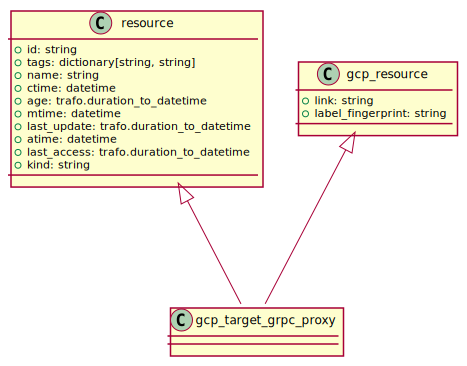

gcp_target_http_proxy
---------------------

gcp_target_https_proxy
----------------------

gcp_target_instance
-------------------

gcp_target_pool
---------------

.. image:: img/gcp_target_pool.svg

gcp_target_ssl_proxy
--------------------

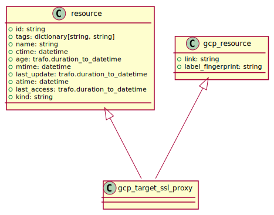

gcp_target_tcp_proxy
--------------------

gcp_target_vpn_gateway
----------------------

gcp_url_map
-----------

gcp_vpn_gateway
---------------

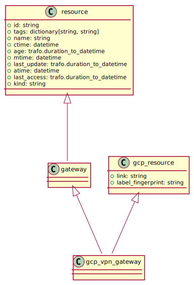

gcp_vpn_tunnel
--------------

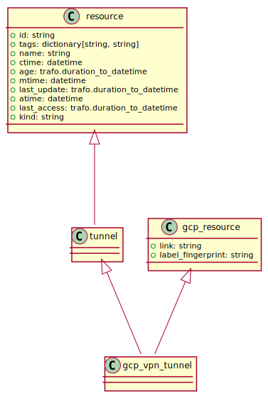

gcp_zone
--------

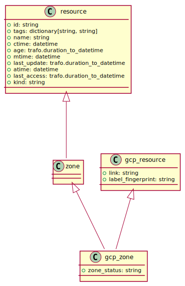

