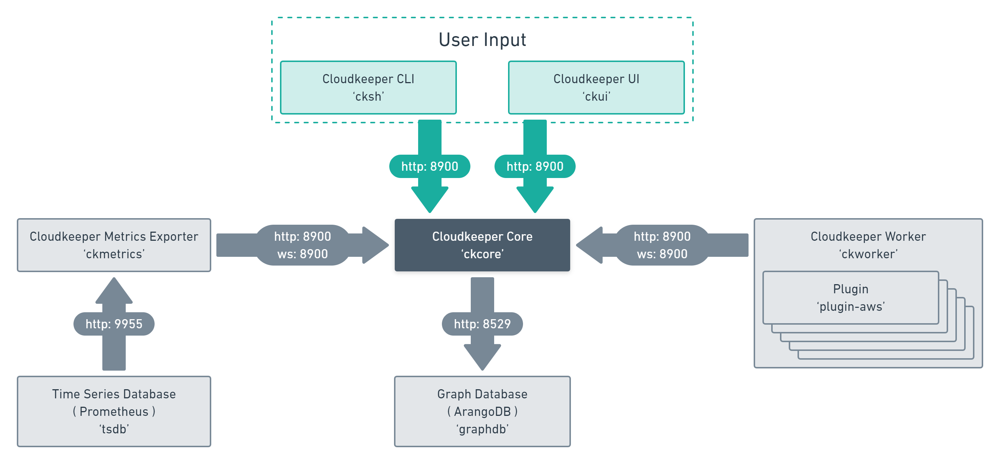

.. _component-list:

Cloudkeeper components
######################

These are the moving parts of cloudkeeper.
We will now guide you through the setup and run procedure for each one.
:ref:`plugins` have no extra section, as they are integrated via :ref:`ckworker`

- :ref:`component-ckcore`: the platform maintaining the `MultiDiGraph <https://en.wikipedia.org/wiki/Multigraph#Directed_multigraph_(edges_with_own_identity)>`_.
- :ref:`component-cksh`: the Cloudkeeper shell to interact with the core.
- :ref:`component-ckmetrics` is a `Prometheus <https://prometheus.io/>`_ `exporter <https://prometheus.io/docs/instrumenting/exporters/>`_.
- :ref:`component-ckworker` provides workers that load `plugins <https://github.com/someengineering/cloudkeeper/tree/main/plugins>`_ to perform collect and cleanup operations.
- :ref:`plugins` are a collection of worker plugins like `AWS <plugins/aws/>`_

To give you a better understanding of how cloudkeepers components interact with each other and where prometheus and arangoDB come in, we have prepared this visualisation for you.

.. _component-ckcore:

ckcore
******

The Cloudkeeper graph platform :ref:`ckcore` is the persistence and query backend of Cloudkeeper. It maintains the graph
of resources and provides APIs to update and access them. Within :ref:`ckcore` there are workflows consisting of steps
that result in actions like ``collect``, ``cleanup`` or ``generate_metrics``. These actions are being received by components
like :ref:`ckworker` and :ref:`ckmetrics`.

:ref:`ckcore` provides the CLI API :ref:`cksh` calls which we will now use as an example.

ckcore - CLI API
================

The API of :ref:`component-ckcore` is exposed via http and websocket.
You can access it via http://<cloudkeeper-address>:8900/

:ref:`component-ckcore` has two API endpoints to connect to for CLI purposes:
* http://<cloudkeeper-address>:8900/cli/evaluate
* http://<cloudkeeper-address>:8900/cli/execute
  
``cli/evaluate`` functinality is used internally on every ``cli/execute`` before the command execution.

Here is a simulation of sending a :ref:`component-cksh` query to the CLI API.
We will evaluate the query before executing it for demonstration. Also we introduce this query with a typo to show the response if not successful.

Evaluate
--------

.. code-block:: bash
    :caption: Evaluate, correct: ``match is("resource") limit 1``

    $ echo 'graph=ck match is("resource") limit 1' | http :8900/cli/evaluate
    HTTP/1.1 200 OK
    Content-Length: 47
    Content-Type: application/json; charset=utf-8
    Date: Wed, 06 Oct 2021 15:13:08 GMT
    Server: Python/3.9 aiohttp/3.7.4.post0

    [
        {
            "execute_query": "is(\"resource\") limit 1"
        }
    ]

.. code-block:: bash
    :caption: Evaluate, typo: ``match is("resource") limit1``

    $ echo 'graph=ck match is("resource") limit1' | http :8900/cli/evaluate
    HTTP/1.1 400 Bad Request
    Content-Length: 151
    Content-Type: text/plain; charset=utf-8
    Date: Wed, 06 Oct 2021 15:13:33 GMT
    Server: Python/3.9 aiohttp/3.7.4.post0

    Error: ParseError
    Message: expected one of '!=', '!~', '<', '<=', '=', '==', '=~', '>', '>=', '[A-Za-z][A-Za-z0-9_]*', '`', 'in', 'not in', '~' at 0:21

Execute
-------

.. code-block:: bash
    :caption: Execute, correct: ``match is("resource") limit 1``

    $ echo 'graph=ck match is("resource") limit 1' | http :8900/cli/execute
    HTTP/1.1 200 OK
    Content-Type: application/json
    Date: Wed, 06 Oct 2021 15:08:10 GMT
    Server: Python/3.9 aiohttp/3.7.4.post0
    Transfer-Encoding: chunked

    [
        {
            "id": "06ee67f7c54124c019b80a7f53fa59b231b374fe61f94b91e0c26729440d095c",
            "kinds": [
                "base_cloud",
                "cloud",
                "resource"
            ],
            "metadata": {
                "python_type": "cloudkeeper.baseresources.Cloud"
            },
            "reported": {
                "ctime": "2021-09-25T23:49:38Z",
                "id": "gcp",
                "kind": "cloud",
                "name": "gcp",
                "tags": {}
            },
            "revision": "_d_7eKMa---",
            "type": "node"
        }
    ]

.. code-block:: bash
    :caption: Execute, typo: ``match is("resource") limit1``

    $ echo 'graph=ck match is("resource") limit1' | http :8900/cli/execute
    HTTP/1.1 400 Bad Request
    Content-Length: 151
    Content-Type: text/plain; charset=utf-8
    Date: Wed, 06 Oct 2021 15:26:54 GMT
    Server: Python/3.9 aiohttp/3.7.4.post0

    Error: ParseError
    Message: expected one of '!=', '!~', '<', '<=', '=', '==', '=~', '>', '>=', '[A-Za-z][A-Za-z0-9_]*', '`', 'in', 'not in', '~' at 0:21

More API Endpoints
==================

:ref:`component-ckcore` is the central HUB for everything Cloudkeeper does.
You can discover :ref:`component-ckcore` APIs directly via WebBrowser (exposed at ``http://<cloudkeeper-address>:8900/``) or in our `repository <https://github.com/someengineering/cloudkeeper/blob/main/ckcore/core/static/api-doc.yaml>`_

There will be examples of typical API Calls in the in depth descriptions of every :ref:`Cloudkeeper component <component-list>`.

.. _component-cksh:

cksh
****

:ref:`component-cksh` starts the Cloudkeeper shell. It is used to interact with :ref:`component-ckcore`.
It allows you to explore the graph, find resources of interest, mark them for cleanup, fix their tagging, aggregate over their metadata to create metrics and format the output for use in a 3rd party script or system.

.. _component-ckmetrics:

ckmetrics
*********

:ref:`component-ckmetrics` takes :ref:`component-ckcore` graph data and runs aggregation functions on it. Those aggregated metrics
are then exposed in a :ref:`prometheus` compatible format.

.. _component-ckworker:

ckworker
********

:ref:`component-ckworker` does all the collection and cleanup work in Cloudkeeper. It is connected to :ref:`component-ckcore` over a websocket connection and waits for instructions. By default it subscribes to the `collect` and `cleanup` actions as well as `tag` tasks.

:ref:`component-ckworker` loads collector :ref:`plugins` like AWS, GCP, Slack, Onelogin, etc.
Only those plugins have knowledge about how to communicate with each cloud. How to collect resources and how to clean them up.

There can be one or more instances of :ref:`component-ckworker` in a Cloudkeeper deployment. A single :ref:`component-ckworker` can collect many clouds or you could have multiple :ref:`component-ckworker` collecting one cloud or even one account in one cloud each.

ckworker deepdive
=================
Once :ref:`component-ckworker` is started you do not have to interact with it at all. It will just sit there, wait for work and do its job.

The following are details on how :ref:`component-ckworker` works internally and how it integrates with :ref:`component-ckcore`.

Workflows
---------

Think of actions and tasks like topics and queues in a messaging system. Actions are broadcast to everyone subscribed for that action.

A task is always given to exactly one worker that knows how to handle it.

Workflows consists of a collection of event types.

Cloudkeeper currently has four workflows built in.

Each workflow step posts into the specific topic. As :ref:`component-ckworker` knows about all plugins for an event type it waits on every individual plugin to finish (or until timeout, which can be configured for each subscription).

When the ``collect`` workflow within :ref:`component-ckcore` is triggered (by either an event or a schedule or because the user manually triggered it), 
:ref:`component-ckcore` will broadcast a ***"start collecting all the cloud accounts you know about"*** message to all the subscribed workers.
Once all the workers finish collecting and sent their graph to the core, the workflow will proceed to the next step which would be ``plan_cleanup``.

This one tells anyone interested to start planing their cleanup based on the just collected graph data.
Once everyone has planed their cleanup and flagged resources that should get cleaned up with the ``desired.clean = true`` flag,
the workflow proceeds to the ``cleanup`` step which again notifies anyone subscribed to now perform cleanup of those flagged resources.

Because the cleaner within :ref:`component-ckworker` has knowledge of all dependencies in the graph,
it will ensure that resources are cleaned up in the right order.

collect
^^^^^^^
The ``collect`` workflow can be triggered via :ref:`component-cksh` command.

.. code-block::
    :caption: Start collect workflow
    
        > start_task collect
        
This will trigger all subscribers to the ``collect`` event type.
As an additional step, this workflow will call the ``metrics`` event type, which will put :ref:`component-ckmetrics` into action.

cleanup
^^^^^^^

This workflow deletes ressources, that were previously marked as to be cleand.
:ref:`setup-ckworker` needs to be started started with the ``--cleanup`` parameter.
Otherwise it will default to a dry-run and NOT delete any ressources.

The collect workflow can be triggered via :ref:`component-cksh` command.

.. code-block::
    :caption: Start cleanup workflow
    
        > start_task cleanup
        
This will trigger all subscribers to the ``cleanup`` event type.
As an additional step, this workflow will call the ``metrics`` event type, which will put :ref:`component-ckmetrics` into action.

metrics
^^^^^^^

The ``metrics`` workflow can be triggered via :ref:`component-cksh` command.

.. code-block::
    :caption: Start metrics workflow
    
        > start_task metrics
        
This will trigger all subscribers to the ``metrics`` event type. This will put :ref:`component-ckmetrics` into action.

collect_and_cleanup
^^^^^^^^^^^^^^^^^^^
The ``collect_and_cleanup`` workflow is hardwired to run automatically every full hour.
This will trigger all ``collect``, ``cleanup`` and ``metrics`` subscribers.

You can trigger this workflow also like the others via :ref:`component-cksh` command.

.. code-block::
    :caption: Start collect_and_cleanup workflow
    
        > start_task collect_and_cleanup

Tasks
-----

When a plugin or a user decides that a resource tag should be added, changed or removed, e.g. by running

.. code-block:: bash

    match id = i-039e06bb2539e5484 | tag update owner lukas

:ref:`component-ckcore` will put this tagging task onto a task queue. This task is then consumed by a :ref:`component-ckworker` that knows how to perform tagging for that particular resource and its particular cloud and account. In our example above where we are setting the tag ``owner: lukas`` for an AWS EC2 instance with ID ``i-039e06bb2539e5484`` the task would be given to a :ref:`component-ckworker` that knows how to update AWS EC2 instance tags in that resources account.
