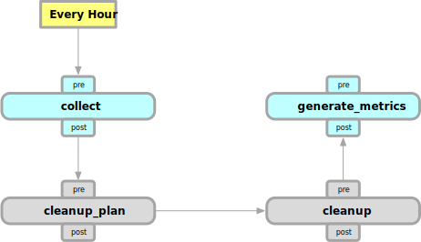
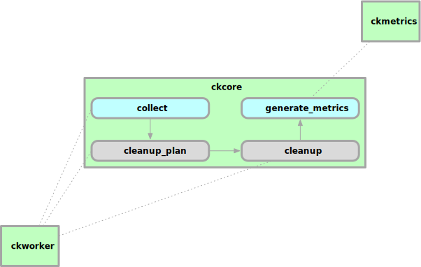

.. _automate:

========
Automate
========

.. _workflow-collect_and_cleanup:

Workflows
---------

Cloudkeeper has a concept of workflows.
A workflow is a set of steps that implements a finite state machine,
where every step performs a specific action.
Workflows can be triggered on a schedule or by an event.

While we want to enable users to create and manipulate workflows on their own, there is currently only one
hardcoded workflow that ships with Cloudkeeper, which is illustrated in the following diagram:

This workflow is triggered by time and runs every full hour.
According to this workflow, the following actions are performed every full hour:

- ``collect`` All configured cloud providers are triggered to collect the available cloud resources.
  The collected resources are given to the core and update the internal database.
  After this step is done, all cloud resources should be available to cloudkeeper.
- ``cleanup_plan`` This step allows selection of resources that should be cleaned up.
  Out of the box, Cloudkeeper will select expired resources if `ckworker` is started with the relevant command-
  line flag (``--cleanup-expired``). Users can hook into this step to select resources, that they think should
  be cleaned up.
  After this step is done, all resources that should be cleaned up are marked internally in ckcore.
- ``cleanup`` When cleanup is enabled in ckworker (``--cleanup``), this step will select all resources that are marked
  for cleanup and will delete them.
  After this step is done, all resources that were marked for cleanup are handled.
- ``generate_metrics`` This step will perform several queries to get updated metrics. Since the incoming data only
  changes during the next collect run, the metrics can be safely generated here and cached until the next collect run.

*Note:* every step shown in this diagram has an additional ``pre`` and ``post`` action. Those actions exist, to
allow additional customization. If you want to trigger functionality after ``collect`` is done, it would be possible
to react on the ``post_collect`` action for example.

The following diagram shows, how *ckworker* and *ckmetrics* use the default workflow. *ckworker* waits for the
``collect`` action. Once this is received, it will run all configured cloud providers to collect the available
cloud resources. It will also listen to the `cleanup_plan` action in case expired resources should be cleaned up.
*ckmetrics* will wait for the ``generate_metrics`` action. Since this action is performed after the collect step,
the metrics operate on the latest available snapshot of data.

Jobs
----

You can use cksh to trigger commands in cloudkeeper. Let's assume you want to find out all resources, that have not
been labeled with an owner tag. The following query should do the trick:

.. code-block:: bash

    $> query is(resource) and reported.tags.owner==null

Let's further assume you want to automatically set the owner tag for such resources. This can be achieved by using
the ``tag`` command, which will update the tags of the elements to the defined value.

.. code-block:: bash

    $> query is(resource) and reported.tags.owner==null | tag update owner "John Doe"

While this is already an improvement, it will only update resources without tags at the moment.
Resources that are created in the future and do not have an owner tag have to be handled the same way again.
Jobs allow you to take a defined CLI Command line, that can be triggered either by time (cron expression) or event.
A job is executed automatically, once the related trigger triggers.

Let's assume we want to ensure, that there will be never resources without owner tag again.
We can use the command line we have written above and turn it into a job:

.. code-block:: bash

    $> add_job post_collect: 'query is(resource) and reported.tags.owner==null | tag update owner "John Doe"'
    Job bbbdcd24 added.

Let's revisit this line to understand what it does:

- the query and tag command is the same that we used before. To not conflict with the `add_job` command line, the
  job command line is wrapped in single quotes (if we would omit those, we would write: ``add_job ... | tag ...``
  which is not what we want).
- ``add_job`` is used to turn the command line into a job. A job is persisted in the database and will be available
  until it is deleted explicitly.
- the job is triggered by the occurrence of the event `post_collect`. See :ref:`workflow-collect_and_cleanup` where
  this event is emitted by the default workflow after all resources have been collected. Since this workflow
  itself is triggered every hour, this job will be called constantly and operate on fresh data.

Please note: the jobs are executed server-side and the resulting output is written to the log file.
It probably does not make a lot of sense to turn commands into jobs that do not have any side effects
(side effects would be sending a notification, triggering a REST endpoint, manipulating the resources directly, etc.),
since you will only see the result in the log stream.

.. code-block:: bash
    :caption: Further examples for job triggers

    # print hello world every minute to the log stream
    $> add_job * * * * * echo hello world

    # print a message when the post_collect event is received
    $> add_job post_collect: echo collect is done!

    # print a message when the first post_collect is received after 4 AM
    # Under the assumption that the post_collect event will come every hour,
    # this job would be only triggered once a day.
    $> add_job 0 4 * * * post_collect: echo collect after 4AM is done!

The job functionality can be used to automate actions. Here is a list of possible topics that
could be natural candidates for automation:

- Encode a set of rules.

  Define rules as queries in a way that all results returned by this query violate the rule.
  The job would run after collect is finished (``post_collect``).
  Ideally, the query will not find a single entry so it will not trigger any further functionality.
  The query should be combined with the ``notify`` command (coming soon) or the ``http`` command to call into another
  system to handle such cases.

- Gather or accumulate data.

  Cloudkeeper has advanced aggregation query capabilities.
  ckmetrics is using it to derive and report metrics to prometheus.
  If additional data besides metrics are relevant to you, create a job that gathers and publishes the data.
  You would use ``query`` aggregation and ``http`` to implement this functionality.

- Up to date diagrams.

  Did you know that Cloudkeeper can provide graph diagrams in dot format?
  Try this in cksh: ``query --include-edges is(graph_root) -[0:2]-> | format --dot | write out.dot``.
  This will query the graph from the root and traverse it 2 levels deep and will also emit all edges.
  The resulting graph will be formatted in `Graphviz <https://graphviz.org>`_ dot format and written to file out.dot.
  If you have graphviz installed, you can now create a diagram from the dot specification,
  for example with: ``sfdp -Tsvg -o out.svg out.dot``.
  You could automate the generation of diagrams and would always have up-to-date documentation.

- Define resources for cleanup

  Cloudkeeper allows you to define resources with an expiration via
  `custom tags <https://github.com/someengineering/cloudkeeper/tree/main/plugins/cleanup_expired#tag-format>`_.
  If you have your idea and logic, to define when resources should be cleaned up,
  hook a job into ``cleanup_plan``.
  Imagine you want to cleanup all compute instances in the load-testing account every Friday night, so they
  will not run over the weekend.
  ``$> add_job 0 22 * * 5 cleanup_plan: 'query is(instance) and ancestors.account.reported.name==load-testing | clean'``

- Enforce tags structure

  Almost all cloud providers offer the ability to annotate resources with tags.
  Those tags are used as metadata store to extend custom functionality.
  It is not an easy task to enforce valid tags, since there is usually nothing from the provider side to help with.
  With Cloudkeeper it is easy to query all resource tags with a simple query.
  There is also the ``tag`` command which allows to update or delete tags.
  So you could set up a job, that notifies people in case the resource does not adhere to a specific format,
  or you can use the ``tag`` command to directly fix the issue.

- Many more..

  This list should give inspiration for possible jobs that can be automated and is by no means complete.
  We are interested in your use case - so please create a PR and extend this list.
