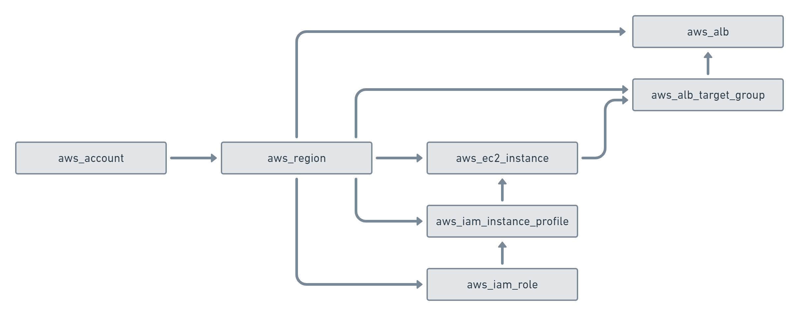
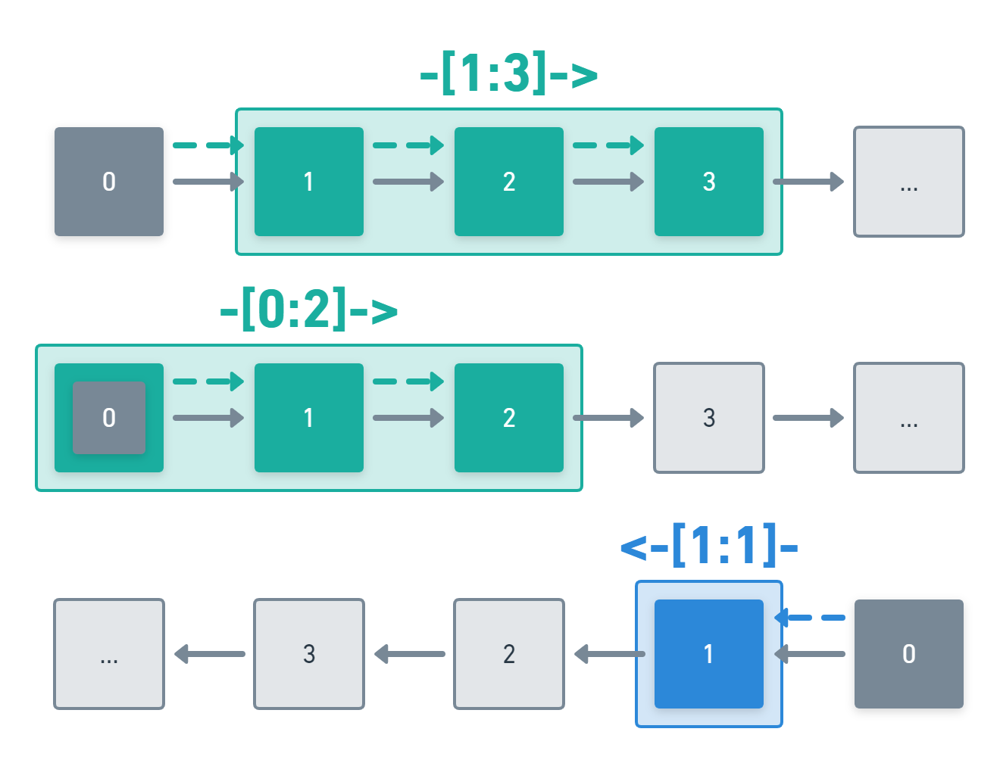
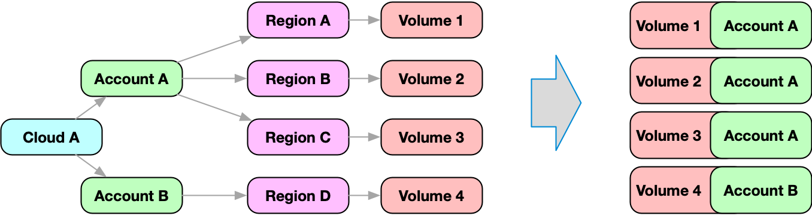

=========
Discovery
=========

You can search your cloud infrastructure and find the resources you are looking for using resotos powerful query language.

resoto maintains its collected data in a graph database. This graph can be accessed via the query language.

.. hint::
  Sending a query in the :ref:`component-resotoshell` CLI is done by using the ``query`` command.

  ``query is(aws_account)``

Commands can be connected using a pipe to form complex and deep requests about resources, dependencies and connections in your infrastructure.

To learn about your new superpowers and use them in the best way, it is important to understand the data model and structure.

.. _graph_node:

Graph Node
==========
A graph node is a json document with a well defined structure and these top level properties:

::

    {
      "id": "xxx",
      "reported": { ... },
      "desired": { ... },
      "metadata": { ... }
    }

Each graph node always has an ``id`` that is a unique ID created by resoto.

The ``reported`` section contains data reported from the specific cloud provider.
The content and schema of the ``reported`` section is defined by the cloud provider and described formally in the :ref:`model`.

The ``desired`` section can be manipulated by users and tools to mark and trigger an intended change on the
specific resource. Cleaning up a resource, for example, is done by setting ``clean=true`` in the desired section.

The ``metadata`` section contains additional data about the resource. This data is not from the cloud provider,
but added by the resoto toolchain.

You can see an example and learn more about the structure in :ref:`graph_node_spotlight`.

.. toctree::
   :maxdepth: 1
   :hidden:

   graph_node_spotlight

Available Commands
==================
In the :ref:`component-resotoshell` CLI you have have a couple of commands available that help you accessing the graph database.

Commands can also be chained by using ``|`` pipes - and not just the following commands!
Chaining is very powerful when used with other commands like ``count``.
We advise to use ``help`` in the :ref:`component-resotoshell` CLI to get more information about the commands.

query
-----

Using the ``query`` command, you can define a search query to filter available nodes.

.. admonition:: Example

  ``query is(account)``

  This will select all accounts of all collected cloud providers.
  In order to select only accounts from AWS, we could achieve this with:

  ``query is(aws_account)``

  It is also possible to filter results by their available properties.
  For example, let us find all AWS accounts that are more than 2 weeks old:

  ``query is(aws_account) and reported.age>2w``

  As you can see multiple criteria can be combined with ``and`` but also with ``or``.
  In order to define precedence, it is also possible to use parentheses.
  To filter aws accounts, that are either older than 2 weeks or have more than 10 users, we would do the following:

  ``query is(aws_account) and (reported.age>2w or reported.users>1)``

  By default, all resources that satisfy the defined criteria will be returned.
  However, it is possible to limit the number of results by specifying ``limit``:

  ``query is(aws_account) and (reported.age>2w or reported.users>1) limit 3``

  In addition to ``limit``, it is also possible to define the sort order.
  The following query will return the 3 AWS accounts that are more than 2 weeks old
  with the most of users.

  ``query is(aws_account) and reported.age>2w sort reported.users desc limit 3``

Selecting Nodes
===============

Select nodes by kind
--------------------

Every node has a kind, which describes the structure of this node.
The model supports inheritance: every specific type is also an instance of
every more general type of this specific type.

Take a graph node with a type of ``aws_ec2_instance`` as an example.
This type is subtype of the types: ``instance``, ``aws_resource`` and ``resource``.

In order to select nodes by a specific type, the query language supports the ``is(kind)``
function. The term ``is(instance)`` would select the ec2 instance above, but also all other
instances, e.g. google cloud instances.

The term ``is(aws_ec2_instance)`` would select only
ec2 instances from aws.

Select nodes by predicate
-------------------------

In order to filter for specific attributes of a node, it is possible to define predicates.
A predicate always has the syntax: ``<property_path> <operation> <value>`` (e.g. ``answer!=42``).

property_path
^^^^^^^^^^^^^

The ``property_path`` is the path to the property in the json structure.
A nested attribute is accessed via the dot (``.``). To access the name in the reported section,
one would write ``reported.name``. A nested property would be accessed via ``reported.deeply.nested.property``.

A property inside an array is accessed via ``[position]``.
So to access the first element of an array we can write ``[0]``.
If the position is not known or does not matter we can write ``[*]``.

operation
^^^^^^^^^

The ``operation`` is one of the following options:

| ``=`` or ``==`` : Property is equal to the provided value.
| ``!=`` : Property is not equal to the provided value.
| ``<=`` : Property is less than or equal to the provided value.
| ``>=`` : Property is greater than or equal to the provided value.
| ``>`` : Property is greater than the provided value.
| ``<`` : Property is less than the provided value.
| ``~`` or ``=~`` : Property conforms to the given regexp. Only applicable to strings.
| ``!~`` : Property is not conform to the given regexp. Only applicable to strings.
| ``in`` : Property is one of the following values. The value has to be an array.
| ``not in`` : Property is not one of the following values. The value has to be an array.

value
^^^^^

The ``value`` can be *any* json literal or *any* json conform value.
A JSON conform value is:

- string:  Examples: ``"hello world"``, ``"test"``. Note: the query parser is gracious with quotes.
  If there are no white space and no special characters, it is possible to omit quotes.
  In case you see parse errors, try adding quotes to your strings.
- number: Integers and float numbers can be expressed. Examples: ``23``, ``12.123``.
  The model itself clearly defines if a number is ``int32``, ``int64``, ``float`` or ``double``.
  From the query point of view, all numbers are treated the same way.
- boolean: Examples: ``true``, ``false``
- array: Examples: ``[1, true, "test"]``
- json object: Examples: ``{"a": 1, "b": 2}``
- null: ``null``
  This can be useful to query for properties that are unset or do not exist.

array values
^^^^^^^^^^^^

If the filtered property is an array, it is also possible to define a criteria based on elements of the array using
one of the operator modifier: ``all``, ``any`` or ``none`` in front of the operation.

Let us assume following document: ``{"reported": { "test": [1, 2, 3, 4]}}``, we could define a query like:
``reported.test all >= 1`` or ``reported.test any > 2`` or ``reported.test none > 100``, which would match the document.

Example predicates
^^^^^^^^^^^^^^^^^^

.. admonition:: Examples of combined terms

  | ``reported.name == "sunset"``
  | Select all nodes where reported.name is *exactly* the string "sunset".

  | ``reported.name == sunset``
  | Same as above. *parentheses are optional as long as the string is not a number and does not have special characters*.

  | ``reported.instance_cores > 2``
  | Select nodes with more than 2 reported.instance_cores.

  | ``reported.name =~ "sun.*"``
  | Selects all nodes where reported.name adheres to the regular expression ``sun.*``.

  | ``reported.name in ["sunset", "sunrise"]``
  | Selects all nodes where reported.name is either sunset or sunrise.

Select nodes by id
------------------

Nodes can be selected by their id via the ``id(xyz)`` function.
This function can be used globally no matter which section is used.

Combine selections
------------------

All listed selections can be combined with ``and`` and ``or`` clauses.
In order to define precedence, it is possible to put brackets around terms.

.. admonition:: Examples of combined terms

  | ``query reported.name == sunset or reported.name == sunrise`` : Select nodes where reported.name is either sunrise or sunset.
  | ``query is(aws_ec2_instance) and reported.name==sunrise`` : Select aws_ec2_instance nodes where reported.name is sunrise.
  | ``query is(aws_ec2_instance) and (reported.instance_type=="m5a.large" or reported.instance_cores>2)`` : Select aws_ec2_instance nodes of specific type or more than 2 cores.

Query a specific section
------------------------

All examples here only used the reported section in order to filter the data.
If your query also only filter data in one section, the section can be defined in front of the query once
and then omitted in the following filter part.

``query reported.instance_type=="m5a.large" or reported.instance_cores>2``

This query can also be written with an explicit section ``reported``:

``query reported instance_type=="m5a.large" or instance_cores>2``

Graph Edges
===========

Nodes in the graph are connected via edges.
Edges in the graph are directed, starting from a node pointing to a node.
In order to traverse the graph in a meaningful way,
it is important to understand the structure of the graph.
The following model is only a subset of the graph model you will find in resoto, but
illustrates nicely how we can walk edges in the graph.

..
    @startuml
    skinparam backgroundColor transparent
    class aws_ec2_instance
    aws_account --> aws_region
    aws_region --> aws_iam_role
    aws_iam_role -> aws_iam_instance_profile
    aws_iam_instance_profile -> aws_ec2_instance
    aws_region --> aws_ec2_instance
    aws_region --> aws_alb_target_group
    aws_ec2_instance --> aws_alb_target_group
    aws_region -> aws_alb
    aws_region -> aws_iam_instance_profile
    aws_alb_target_group -> aws_alb
    @enduml

All of the resources in aws are placed in a region.
The region is one node in the graph.
If we want to know all resources in the graph we need to walk *outbound* (following the edges in direction of the arrow).
If we want to know the account of a specific resource, we need to walk *inbound* (following the edge in reverse direction of the arrow)
in the graph until we find an account.

Traversal Selectors
===================

Inbound and outbound
--------------------

``<--`` traverses the graph inbound, ``-->`` traverses the graph outbound.

.. image:: img/graph_query_inout.png

Select all direct nodes outbound of node
----------------------------------------

``-->`` traverse the graph outbound to the next level.

.. admonition:: Example

  ``query is(aws_account) -->``

  This will select all aws accounts and then traverse in the graph outbound.
  According to the model above, this query would return a list of all matching regions.

  .. image:: img/graph_query_outbound_example.png

Select all direct nodes inbound of node
---------------------------------------

``<--`` traverse the graph inbound to the next level

.. admonition:: Example

  ``query is(aws_ec2_instance) <-- is(aws_region)``

  This will select all aws ec2 instances in the database and then traverse in the graph inbound.
  According to the model above, this query would return a list of all matching regions and instance profiles.
  For the sake of this example, we want to filter this list even further to only return the aws regions of the ec2 instances.

  .. image:: img/graph_query_inbound_example.png

Select nodes that include the current node
------------------------------------------

``-[0:1]->`` traverse the graph outbound starting from the current node **(0)** until the next level **(1)**.
The result will contain the current node plus all nodes one level outbound.
The same applies for inbound  with this statement ``<-[0:1]-``.

.. admonition:: Example

  ``query is(aws_region) -[0:1]->``

  This will return a list of all resources "under" a aws_region together with the matching aws_region.

  .. image:: img/graph_query_01.png

.. admonition:: Example

  ``query is(aws_region) and reported.name==global <-[0:1]-``

  This will return a list of all aws_regions with name ``global`` together with all accounts.

Select nodes with a defined depth in the graph
----------------------------------------------

``-[start:until]->`` traverses the graph outbound starting from a user defined depth to a user defined depth.
The graph will be traversed from the current node according to this specification. All matching nodes will be returned.
The same applies for inbound traversals with ``<-[start:until]-``.

.. admonition:: Example

  ``query is(aws_alb_target_groups) <-[2:2]- is(aws_iam_instance_profile)``

  This query can answer the question: which instance profile is used for ec2 instances connected to an alb target group.
  It selects all aws_alb_target_groups and than traverses 2 levels inbound in the graph and filters for aws_iam_instance_profiles.
  The result is a list of aws_iam_instance_profiles.

Select nodes with an undefined depth in the graph
-------------------------------------------------

``-[start:]->`` traverses the graph outbound starting from a user defined depth to the leafs of the graph.
The graph will be traversed from the current node according to this specification. All matching nodes will be returned.
The same applies for inbound traversals with ``<-[start:]-``.

.. admonition:: Example

  ``query is(aws_account) and reported.name==sunshine -[0:]->``

  This query will select the aws account with name ``sunshine`` and then select all nodes outbound to this node.
  This will select everything resoto knows about nodes in this account.

Select inbound and outbound nodes
---------------------------------

``<-[start:until]->`` traverses the graph inbound and outbound starting from a user defined depth to a user defined depth.
The graph will be traversed from the current node according to this specification. All matching nodes will be returned.

.. admonition:: Example

  ``query reported.name="sunset" and is(aws_account) <-[0:]->``

  This will select all nodes that are connected on any depth in any way to the AWS account with the name sunset.

Abbreviations
-------------

There are abbreviations for the most common traversal selectors.

.. admonition:: Example

  | ``-->`` and ``<--`` are abbreviations to ``-[1:1]->`` and ``<-[1:1]-``
  | ``query is(aws_account) -->`` is equivalent to ``query is(aws_account) -[1:1]->``

  | ``<-->`` is an abbreviation for ``<-[1:1]->``
  | ``query is(aws_region) <-->`` is equivalent to ``query is(aws_region) <-[1:1]->``

  | ``<-[x]-`` is an abbreviation for ``<-[x:x]-``
  | ``query is(aws_region) <-[3]->`` is equivalent to ``query is(aws_region) <-[3:3]->``

Traversal Selection Commands
----------------------------

There are also commands doing a traversal selection that you can chain using a pipe.

.. admonition:: Example

  | ``predecessors`` is a command being substituted for ``<--`` / ``<-[1:1]-``
  | ``query is(aws_region) | predecessors`` is equivalent to ``query is(aws_region) <--``

  | ``successors`` is a command being substituted for ``-->`` / ``-[1:1]->``
  | ``query is(aws_region) | successors`` is equivalent to ``query is(aws_region) -->``

  | ``ancestors`` is a command being substituted for ``<-[1:]-``
  | ``query is(aws_region) | ancestors`` is equivalent to ``query is(aws_region) <-[1:]-``

  | ``descendants`` is a command being substituted for ``-[1:]->``
  | ``query is(aws_region) | descendants`` is equivalent to ``query is(aws_region) -[1:]->``

Ensuring an existing defined graph structure
============================================

There are certain scenarios, where nodes need to be selected that have defined relationships and position in the
graph without selecting the related nodes.

Example: We want to select all ALB target groups where there is no EC2 instance using the ALB.

::

    query is(aws_alb_target_group) with (empty, <-- is(aws_ec2_instance))

The ``is(aws_alb_target_group)`` part selects all aws_alb_target_groups.
The ``with`` part filters this list by ensuring a defined graph structure.
The defined graph structure is described by ``(empty, <-- is(aws_ec2_instance))`` and says:

- traverse the graph inbound and filter all aws_ec2_instances
- count the resulting nodes
- select the aws_alb_target_group if there are no resulting nodes for this node
- the result will not have any data from the graph traversal of the with clause

The ``with`` clause allows for the following forms:

Ensure there is no matching node
--------------------------------

``<filter> with (empty, <navigation> [filter])``

The filter will select elements. With every element a graph traversal is done
following the navigation and filter in the with clause.
No result is allowed in order to select the node.

Ensure there is at least one matching node
------------------------------------------

``<filter> with (any, <navigation> [filter])``

Same as the ``empty`` case with the difference: the with clause needs to select
at least one matching node in order to select the filtered node.

Ensure there is a specific count of matching nodes
--------------------------------------------------

``<filter> with (count==3, <navigation> [filter])``

Same as the ``empty`` case with the difference: the with clause needs to select
the specified amount of matching nodes in order to select the filtered node.

Please note: the with clause can be nested.
Inside a with clause, you can use another with clause for nested expectations.
The outermost element is filtered only if the outermost with clause holds,
which includes that all inner with clauses have to match as well.

This is a powerful construct to define queries to match a defined graph structure or
to select nodes which are not in a predefined graph structure.

Merge node data with sub-queries
================================

The data in resoto is stored in a graph.
While it is possible to query and retrieve a filtered part of the graph, it is sometimes helpful to retrieve
structural graph data as part of the node. This approach merges multiple nodes in a graph into one node.
This combined node can simplify processing the node.

.. image:: img/merge_nodes.png

The merge node feature allows for sub-queries, that are executed for every node in the result.
The result of the sub-query is then merged with the node data.

.. admonition:: Example

    Most cloud resources are maintained in an account. Accounts are modeled as nodes in resoto.
    Resources reference the region node, while the region node references the account node.
    In order to retrieve the account, the graph has to be traversed inbound from the resource node until the
    account node is found. While this is possible, it might be more convenient to get the account information
    as part of the node!

    In this example we will query nodes of kind ``volume``. For every element that is returned,
    a sub-query is executed, which will traverse the graph inbound until it finds a node of kind ``account``.
    The result of this sub-query is merged with the volume node on root level under the name account.
    The complete information about the account is available as part of the volume node:

::

    > query is(volume) { account: <-[0:]- is(account) } limit 1 | dump
    reported:
        .
        .
    account:
        reported:
            .
            .

A sub-query is a complete query and can use the features of any other query.
The result of a sub-query is merged with the original node under the given merge name.
If the merge name is a simple literal, zero or one result of the sub-query is expected.
This also means, that the graph traversal of the sub-query stops, when the first matching element is found.
If the expected result of the sub-query is a list, than the merge name has to be defined with square brackets.
Following query will traverse inbound on every element and collect all predecessors under the name ``predecessors`` ).

::

    > query is(volume) { predecessors[]: <-- all } limit 1 | dump
    reported:
        .
        .
    predecessors:
    - reported:
        .
        .
    - reported:
        .
        .

It is possible to define multiple merge queries in one query statement.

.. image:: img/merge_nodes.png

::

    > query is(volume) { account: <-[0:]- is(account), region: <-[0:]- is(region) } limit 1 | dump
    reported:
        .
        .
    account:
        reported:
            .
            .
    region:
        reported:
            .
            .

A sub-query can be defined using sub-queries.

::

    query = <pre_filter> { <merge_name_1>: <query>, .., <merge_name_n>: <query> } <post_filter>

Note on performance: be aware that a sub-query is executed for every node of the original query and
might be expensive and time intensive to compute.

Aggregation of data
===================

There are several situations where specific data is not too relevant but needs lifting to a higher level. That is where aggregation comes into play.

Aggregation allows to group entities by one or more properties and then do math operations on that group.

Aggregation example
-------------------

Let's look at an example to understand the concept better.

For the sake of this example, consider this query:

::

   > query is(instance) and reported.age > 3y

This will select all compute instances in my cloud, that are older than 3 years.

If I only want to know the number of instances, that matches that criteria, I could write this:

::

   > query aggregate(sum(1) as count): is(instance) and reported.age > 3y
   count: 20

which would return the total number of all compute instances that are older than 3 years.

| You can see the ``aggregate():`` part in front of the filter query part.
| The query part itself has not changed - the aggregation part tells resoto to aggregate the resulting data based on the defined criteria.

| Every resulting element of the filter query is passed to the aggregation function.
| This function can aggregate data from the incoming element using on of ``sum(x)``, ``min(x)``, ``max(x)`` or ``avg(x)``.

.. hint::

  This criteria in this case is ``sum(1) as count``, which uses the static value ``1`` for every element passed and then sums it up.

  Since every element counts as ``1`` - ``sum(1)`` is basically the number of elements passed.

  Please note, that the variable to sum does not need to be a static value, but could come from the element passed to this function.

If we would like to know the number of CPU cores, we could rewrite the aggregation like this:

::

    > query aggregate(
        sum(1) as count,
        sum(reported.instance_cores) as cores):
      is(instance) and reported.age > 3y
    count: 20
    cores: 62

In addition to the instance count, we also get the total number of instance cores in the system.

| All of the above aggregations do not use any grouping information.
| Grouping can be a powerful feature, since it allows to make the defined computation on separate groups.

Let's assume we want to know the number of instances and cores for compute instances, grouped by its instance status:

::

    > query aggregate(
        reported.instance_status as status:
        sum(1) as count, sum(reported.instance_cores) as cores):
      is(instance) and reported.age > 3y
    group:
      status: stopped
    count: 15
    cores: 51
    ---
    group:
      status: terminated
    count: 5
    cores: 11

The query is the same and the aggregation functions are the same.

The only addition here is the aggregation group: ``reported.instance_status``, which is defined by every compute instance.
The result of this addition: the computation is performed on every matching subgroup.

Each group is identified by the value of the grouping variable.
Every compute instance is put into one subgroup by its reported ``instance_status`` property.

We can see that there are 15 stopped and 5 terminated instances, with the related number of cores.
It is totally possible to group by more than one variable.

Let's also use the instance_type as an additional group variable:

::

    > query aggregate(
        reported.instance_status as status,
        reported.instance_type as type:
        sum(1) as count,
        sum(reported.instance_cores) as cores):
      is(instance) and reported.age > 3y
    group:
      status: stopped
      type: m5.xlarge
    count: 12
    cores: 48
    ---
    group:
      status: stopped
      type: t2.micro
    count: 3
    cores: 3
    ---
    group:
      status: terminated
      type: n1-standard-1
    count: 1
    cores: 1
    ---
    group:
      status: terminated
      type: n1-standard-2
    count: 3
    cores: 6
    ---
    group:
      status: terminated
      type: n1-standard-4
    count: 1
    cores: 4

Syntax of an aggregation query part
-----------------------------------

General structure of every aggregation query:

::

    aggregate([grouping_part:] [function_part]): [query]

| The grouping part is optional and could be omitted.
| All grouping variables are separated by comma.
| Every grouping variable can have an ``as <name>`` clause to give the variable a specific name: ``<path_to_prop> as <name>``.
| If the ``as <name>`` clause is omitted, a name is derived from the property path.

::

    path.to.property1 as p1, path.to.property2 as p2

| The grouping function part is mandatory with this syntax: ``<function>(..)``.
| Every grouping function can have an ``as <name>`` clause to give the function result a specific name: ``<function>(..) as <name>``.
| If the ``as <name>`` clause is omitted, a name is derived from the function name and property path.

::

    sum(1) as fp1, avg(path.to.property) as fp2

Following functions are supported:

- ``sum(x)`` Sum x over all incoming elements. x can be a static value or the path to a property.
- ``min(x)`` Return the smallest seen x over all incoming elements.
- ``max(x)`` Return the biggest seen x over all incoming elements.
- ``avg(x)`` Compute the average over all x.

Examples of aggregation functions
---------------------------------

.. code-block:: default
    :caption: Count all instances in the system

    query aggregate(
      sum(1) as count):
      is(instance)

.. code-block:: default
    :caption: Count all instances and instance cores in the system

    query aggregate(
      sum(1) as count,
      sum(instance_cores) as cores):
      is(instance)

.. code-block:: default
    :caption: Same as before, but group all instances by status

    query aggregate(
      instance_status as status: sum(1) as count,
      sum(instance_cores) as cores):
      is(instance)

.. code-block:: default
    :caption: Same as before, but group all instances by status and type

    query aggregate(
      instance_status as status,
      instance_type as type: sum(1) as count,
      sum(instance_cores) as cores):
      is(instance)
