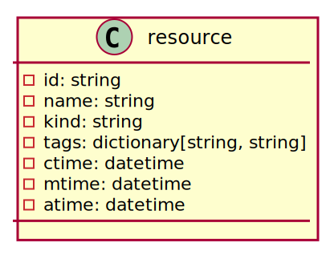
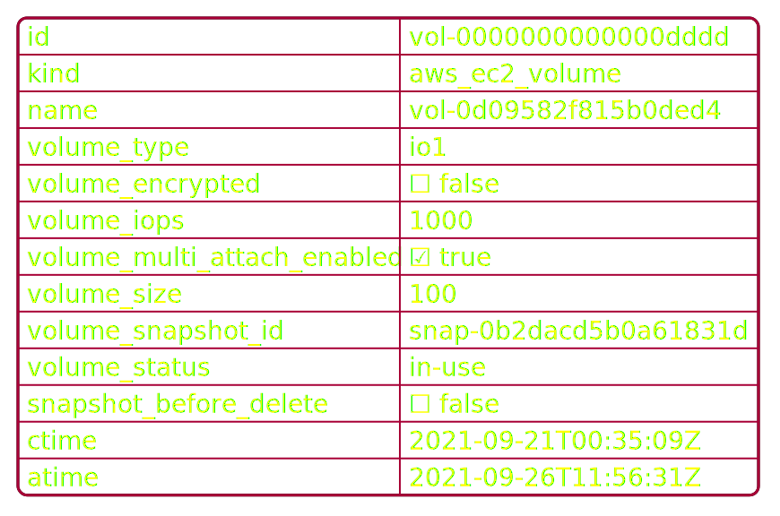

Model
=====

Cloudkeeper is able to collect data from different data sources that is maintained in a graph.
It has a pluggable API to interface with different cloud providers.
The data model of the cloud providers is naturally defined by the cloud provider, so Cloudkeeper
needs to deal with different data sources and different data models.

To make your life easier, Cloudkeeper introduces a model abstraction.
Every resource collected by CloudKeeper is described by a data model and checked for consistency during import time.
To show an example, the following diagram shows an excerpt of the complete cloudkeeper data model.

Resource
--------

Every resource collected by CloudKeeper has the kind ``resource`` as base.
Here we see properties, that is common to every resource, no matter which resource or which cloud provider:

..
    @startuml
    skinparam backgroundColor transparent

    class resource {
    - id: string
    - name: string
    - kind: string
    - tags: dictionary[string, string]
    - ctime: datetime
    - mtime: datetime
    - atime: datetime
    }
    @enduml

- ``id``: identifier of this cloud specific resource.
  This id does not need to be unique over all resources.
- ``name``: the cloud specific name of this resource.
- ``kind``: this property is synthesized by Cloudkeeper and defines the concrete kind of this resource.
  Example: in AWS there exist `AWS EC2 Volume <https://docs.aws.amazon.com/AWSCloudFormation/latest/UserGuide/aws-properties-ec2-ebs-volume.html>`_
  All collected AWS EC2 volumes would be of kind ``aws_ec2_volume``.
- ``tags``: most cloud provider offer the ability to define tags on resources.
  Tags are simple key value pairs of type string that are held in a dictionary.
- ``ctime``: the point in time when the resource has been created.
  Note: when the cloud provider does not provide this information, Cloudkeeper
  will set this property to the time, when it has discovered this resource the first time.
- ``atime``: the last collected point in time when the resource has been accessed.
  Note: this this time is not available on all resources for all cloud providers.
  Cloudkeeper tries to do its best to synthesize the last access time based on the resource type.
  (Example: it uses AWS CloudWatch to detect last usages etc).
- ``mtime``: the last collected point in time when the resource has been modified.
  Note: this this time is not available on all resources for all cloud providers.
  Cloudkeeper tries to do its best to synthesize the last modification time based on the resource type.

Resource Hierarchy
------------------

Cloukeeper introduces a resource hierarchy. This hierarchy tries to do its best to abstract over
the different data models from different cloud providers, delivering a consistent model to retrieve
data from your different clouds.

Every concrete resource in Cloudkeeper has the ``resource`` kind as root.
Cloudkeeper introduces abstract model classes for almost all different resources that are collected.

..
    @startuml
    skinparam backgroundColor transparent

    class resource {
    }
    class account
    class volume {
    volume_size: int64
    volume_type: string
    volume_status: string
    volume_iops: int64
    volume_throughput: int64
    volume_encrypted: boolean
    snapshot_before_delete: boolean
    }
    class aws_ec2_volume {
    volume_kms_key_id: string
    volume_multi_attach_enabled: boolean
    volume_outpost_arn: string
    volume_snapshot_id: string
    }
    class gcp_disk {
    last_attach_timestamp: datetime
    last_detach_timestamp: datetime
    }
    resource <|- cloud
    account -|> resource
    resource <|-- volume
    volume <|-- aws_ec2_volume
    volume <|-- gcp_disk
    @enduml

.. image:: _static/images/resource_example.svg
  :width: 75%
  :alt: Resource Example Model

Let us make this very clear by showing a specific example: `AWS EC2 Volume <https://docs.aws.amazon.com/AWSCloudFormation/latest/UserGuide/aws-properties-ec2-ebs-volume.html>`_
which is modeled as ``aws_ec2_volume``. As you can see the ``aws_ec2_volume`` introduces 4 properties.
It is inheriting from the base kind ``volume``, which itself is inheriting all properties from base kind ``resource``.
The complete data that is collected and stored could look like this example data:

..
    @startjson
        
        {
            "id": "vol-0000000000000dddd",
            "kind": "aws_ec2_volume",
            "name": "vol-0d09582f815b0ded4",
            "volume_type": "io1",
            "volume_encrypted": false,
            "volume_iops": 1000,
            "volume_multi_attach_enabled": true,
            "volume_size": 100,
            "volume_snapshot_id": "snap-0b2dacd5b0a61831d",
            "volume_status": "in-use",
            "snapshot_before_delete": false,
            "ctime": "2021-09-21T00:35:09Z",
            "atime": "2021-09-26T11:56:31Z"
        }
    @endjson

You might have noticed, that not only ``aws_ec2_instance`` is a subtype of ``volume``,
but also ``gcp_disk``. A google cloud resource of type `Disk <https://cloud.google.com/compute/docs/reference/rest/v1/disks>`_
is conceptually similar to an AWS EC2 Volume and shares quite some properties.
The model makes it easy to query conceptually common data and also to retrieve and reason about this data.

``kind`` CLI command
--------------------

If you want to see all available kinds in the system, you can use the ``kind`` cli command in ``cksh``.

Example:

::

  $> kind
  - access_key
  - account
  - any
  - autoscaling_group
  - aws_account
  .
  .

If you want to see the properties of a specific kind use ``kind <name>``:

Example:

::

    > kind aws_ec2_volume
    name: aws_ec2_volume
    bases:
    - resource
    - volume
    - aws_ec2_volume
    properties:
    - name: id
      kind: string
    .
    .

Complex and simple kinds
-----------------

| We have looked at complex kinds so far: a complex kind has a name and a set of properties.
| Each property has a name and also a kind.
| The kind of such a property can be a complex or a simple kind.

There are several simple kinds that are available in Cloudkeeper out of the box:

.. list-table::
   :widths: 25 25 75
   :header-rows: 1

   * - kind
     - Json type
     - Example
   * - string
     - string
     - "foo", "bla", "some long string"
   * - boolean
     - boolean
     - true, false
   * - null
     - null
     - null
   * - int32
     - number
     - 1234, 4321, -123
   * - int64
     - number
     - 1234, 4321, -123
   * - float
     - number
     - 12, 12.1234, -23.123
   * - double
     - number
     - 12, 12.1234, -23.123
   * - datetime
     - string
     - "2021-03-15T23:04:56Z", "2021-03-15", "-3d"
   * - date
     - string
     - "2021-03-15", "03/15/2021", "-3d"
   * - any
     - any of the above
     - null, true, "test", 123, -12.43

Since Cloudkeeper uses json in order to exchange data, all the different simple types
have to be expressed as simple json type.

Cloudkeeper also introduces some additional simple types like ``datetime`` or ``date``.
The reason for this is the ability to coerce proper values from values given to Cloudkeeper.

Example: Let us assume a user want to query a resource by creation time.
According to the model we would need to filter for the ``ctime`` property.
Since Cloudkeeper knows the type of ``ctime`` (which is of kind datetime), it can
do its best to interpret the value given by the user.

::

   match ctime < "2018-09-28"

``ctime`` is of type datetime. datetime is stored in CloudKeeper always as ISO formatted datetime string.
To make this query effective, the term ``"2018-09-28"`` is coerced into a valid datetime.
Depending on the server time the value would be evaluated to something like:

::

  match ctime < "2021-09-28T22:00:00Z"

This also allows the usage of relative times, when the type of the property is known as datetime.
If we want to query resources, that have been created in the last 3 days, we could express this with a relative datetime.

::

  match ctime > "-3d"

This translates the term ``"-3d"`` using the current server time into a valid datetime.
On my machine this translates into:

::

  match ctime > "2021-09-26T08:13:56Z"

The special type ``any`` is only used in scenarios, when the type is really not known and
could be anything. Coercing is not possible for such a type.
