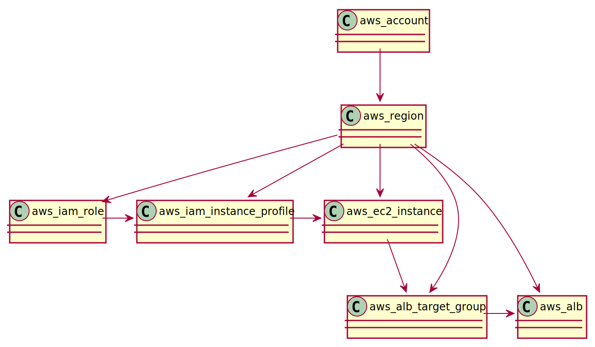

Graph Query
===========

Cloudkeeper maintains its data in a graph database. The graph can be accessed via a powerful query language.
To get familiar with a Cloudkeeper query, it is important to understand the underlying data model and structure.

Graph Node
----------

A node in a graph is a json document with a well defined structure and those top level properties:

::

    {
      "id": "xxx",
      "kinds": [ ... ],
      "reported": { ... },
      "desired": { ... },
      "metadata": { ... }
    }

- ``id`` : This is a synthetic unique identifier of this node that is created by Cloudkeeper.
  It is used to maintain the node as well as all edges from and to this node.
- ``kinds``: This array contains all kinds of this node. It is derived from the kind of
  this node and includes the current kind as well as all parent kinds.
  See :doc:`model<./model>` for an explanation of kind.
- ``reported`` : This section is a json document and shows the reported properties from the
  collector. The data that is collected is specific to the cloud and the resource type.
  The reported data is of a specific ``kind`` indicated by the same property. The complete
  structure of the reported section is described in the model :doc:`model<./model>`.
- ``desired`` : This section is a json document and shows desired changes of this node.
  Desired changes are reflected by humans and tools via the API or command line.
  The desired section is not described via a `kind` model and allows arbitrary data.
- ``metadata`` : This section is a json document and shows metadata of this resource.
  The metadata section is intended to keep data attached to this resource, but not
  originating from the resource or the provider itself.
  metadata is created by humans and/or tools via the API or command line.
  The metadata section is not described via a `kind` model and allows arbitrary data.

Example node data showing data from an `AWS EC2 Instance <https://aws.amazon.com/ec2>`_
We use this example in the following sections to show query capabilities.

::

    {
      "id": "c0a43527846739d88c9",
      "kinds": [
        "aws_ec2_instance",
        "instance",
        "resource",
        "aws_resource"
      ],
      "reported": {
        "kind": "aws_ec2_instance",
        "id": "i-0994caaa55576a33d",
        "tags": {
          "expiration": "never",
          "name": "sunset",
          "owner": "nick"
        },
        "name": "sunset",
        "ctime": "2019-12-20T10:14:19Z",
        "instance_cores": 2,
        "instance_memory": 8,
        "instance_type": "m5a.large",
        "instance_status": "running"
      },
      "desired": {
        "clean": true
      },
      "metadata": {
        "ancestors": {
          "cloud": {
            "name": "aws",
            "id": "aws"
          },
          "account": {
            "name": "eng-production",
            "id": "139234212332"
          },
          "region": {
            "name": "us-east-1",
            "id": "us-east-1"
          }
        }
      }
    }

Graph Sections
--------------

A graph node has the 3 main sections: reported, desired and metadata.

The API allows to query either on the root level of the node or inside a specific section of
the node. Same is true for querying on the CLI: the ``query`` command access the node on the root
level, where the ``reported`` command accesses the node on the ``reported`` section (same goes
for ``metadata`` and ``desired``).

In order to query for the reported name of the ec2 instance in the example we could
query on global level via ``reported.name`` or reported level via ``name``.
Inside ``metadata`` and ``desired`` is the ``reported`` section not reachable.

The following sections always assume the global level.

Selecting Nodes
---------------

#.  Select nodes by kind:

    Every node has a kind, which describes the structure of this node.
    The model supports inheritance: every specific type is also an instance of
    every more general type of this specific type. In out example above, the resource
    is of type ``aws_ec2_instance``.
    This type is subtype of the types: ``instance``, ``aws_resource`` and ``resource``.

    In order to select nodes by a specific type, the query language supports the ``is(kind)``
    function. The term ``is(instance)`` would select the ec2 instance above, but also all other
    instances, e.g. google cloud instances. The term ``is(aws_ec2_instance)`` would select only
    ec2 instances from aws.

    Since the `is(kind)` does not belong to any section, it can be used on every level.

#.  Select nodes by predicate:

    In order to filter for specific attributes of a node, it is possible to define predicates.
    A predicate always has the syntax: ``<property_path> <operation> <value>``.

    The ``property_path`` is the path to the property in the json structure.
    A nested attribute is accessed via the `.`.
    To access the name in the reported section, one would write `reported.name`.
    A property inside an array is accessed via `[position]`.
    So to access the first element of an array we can write `[0]`.
    If the position is not known or does not matter we can write `[*]`.

    The ``operation`` is one of the following options:

    - ``=`` or ``==`` : the property is equal to provided value.
    - ``!=`` : the property is not equal to provided value.
    - ``<=`` : the property is less then or equal to provided value.
    - ``>=`` : the property is greater then or equal to provided value.
    - ``>``  : the property is greater then the provided value.
    - ``<``  : the property is less than the provided value.
    - ``~`` or ``=~``   : the property is conform to given regexp. Only applicable to strings.
    - ``!~``  : the property is not conform to given regexp. Only applicable to strings.
    - ``in``  : the property is one of the following values. The value has to be an array.
    - ``not in`` : the property is not one of the following values. The value has to be an array.

    The ``value`` can be any json literal or any json conform value.

    Example predicates:

    - ``reported.name == "sunset"`` would select all nodes where reported.name is exactly the string "name".
    - ``reported.name == sunset`` same as above. parentheses are optional as long as the string is not a number and does not have special characters.
    - ``reported.instance_cores > 2`` select nodes with more than 2 reported.instance_cores.
    - ``reported.name =~ "sun.*"`` selects all nodes where reported.name adheres to the regular expression ``sun.*``.
    - ``reported.name in ["sunset", "sunrise"]`` selects all nodes where reported.name is either sunset or sunrise.

#.  Select nodes by id:

    Nodes can be selected by its id via the `id(xyz)` function.
    This function can be used globally no matter which section is used.

#.  Combine selections

    All listed selections can be combined with ``and`` and ``or`` clauses.
    In order to define precedence, it is possible to put brackets around terms.

    Example of combined terms:

    - ``reported.name == sunset or reported.name == sunrise`` select nodes where reported.name is either sunrise or sunset.
    - ``is(aws_ec2_instance) and reported.name==sunrise`` select aws_ec2_instance nodes where reported.name is sunrise.
    - ``is(aws_ec2_instance) and (reported.instance_type=="m5a.large" or reported.instance_cores>2)`` select aws_ec2_instance nodes of specific type or more than 2 cores.

Graph Edges
-----------

Nodes in the graph are connected via edges.
Edges in the graph are directed, starting from a node pointing to a node.
In order to traverse the graph in a meaningful way,
it is important to understand the structure of the graph.
The following model is only a subset of the graph model you will find in Cloudkeeper, but
illustrates nicely how we can walk edges in the graph.

..
    @startuml
    skinparam backgroundColor transparent
    class aws_ec2_instance
    aws_account --> aws_region
    aws_region --> aws_iam_role
    aws_iam_role -> aws_iam_instance_profile
    aws_iam_instance_profile -> aws_ec2_instance
    aws_region --> aws_ec2_instance
    aws_region --> aws_alb_target_group
    aws_ec2_instance --> aws_alb_target_group
    aws_region -> aws_alb
    aws_region -> aws_iam_instance_profile
    aws_alb_target_group -> aws_alb
    @enduml

All of the resources in aws are placed in a region.
The region is one node in the graph.
If we want to know all resources in the graph we need to walk *outbound* (following the edges in direction of the arrow).
If we want to know the account of a specific resource, we need to walk *inbound* (following the edge in reverse direction of the arrow)
in the graph until we find an account.

#. Select all direct nodes outbound of node

    ``-->`` traverse the graph outbound to the next level.

    Example: ``is(aws_account) -->``

    This will select all aws accounts and then traverse in the graph outbound.
    According to the model above, this query would return a list of all matching regions.

#. Select all direct nodes inbound of node

    ``<--`` traverse the graph inbound to the next level

    Example: ``is(aws_ec2_instance) <-- is(aws_region)``

    This will select all aws ec2 instances in the database and then traverse in the graph inbound.
    According to the model above, this query would return a list of all matching regions and instance profiles.
    For the sake of this example, we want to filter this list even further to only return the aws regions of the ec2 instances.

#. Select nodes that include the current node

    ``-[0:1]->`` traverse the graph outbound starting from the current node until the next level.
    The result will contain the current node plus all nodes one level outbound.
    The same applies for inbound  with this statement `<-[0:1]-`.

    Example: ``is(aws_region) -[0:1]->``

    This will return a list of all resources "under" a aws_region together with the matching aws_region.

    Example: ``is(aws_region) and reported.name==global <-[0:1]-``

    This will return a list of all aws_regions with name ``global`` together with all accounts.

#. Select nodes with a defined depth in the graph

    ``-[start:until]->`` traverses the graph outbound starting from a user defined depth to a user defined depth.
    The graph will be traversed from the current node according to this specification. All matching nodes will be returned.
    The same applies for inbound traversals with ``<-[start:until]-``.

    Example: ``is(aws_alb_target_groups) <-[2:2]- is(aws_iam_instance_profile)``

    This query can answer the question: which instance profile is used for ec2 instances connected to an alb target group.
    It selects all aws_alb_target_groups and than traverses 2 levels inbound in the graph and filters for aws_iam_instance_profiles.
    The result is a list of aws_iam_instance_profiles.

#. Select nodes with an undefined depth in the graph

    ``-[start:]->`` traverses the graph outbound starting from a user defined depth to the leafs of the graph.
    The graph will be traversed from the current node according to this specification. All matching nodes will be returned.
    The same applies for inbound traversals with ``<-[start:]-``.

    Example: ``is(aws_account) and reported.name==sunshine -[0:]->``

    This query will select the aws account with name ``sunshine`` and then select all nodes outbound to this node.
    This will select everything Cloudkeeper knows about nodes in this account.

Ensuring an existing defined graph structure
--------------------------------------------

There are certain scenarios, where nodes need to be selected that have defined relationships and position in the
graph without selecting the related nodes.

Example: We want to select all ALB target groups where there is no EC2 instance using the ALB.
::

    is(aws_alb_target_group) with (empty, <-- is(aws_ec2_instance))

The ``is(aws_alb_target_group)`` part selects all aws_alb_target_groups.
The `with` part filters this list by ensuring a defined graph structure.
The defined graph structure is described by ``(empty, <-- is(aws_ec2_instance))`` and says:

- traverse the graph inbound and filter all aws_ec2_instances
- count the resulting nodes
- select the aws_alb_target_group if there are no resulting nodes for this node
- the result will not have any data from the graph traversal of the with clause

The ``with`` clause allows for the following forms:

#. Ensure there is no matching node:

   ``<filter> with (empty, <navigation> [filter])``

    The filter will select elements. With every element a graph traversal is done
    following the navigation and filter in the with clause.
    No result is allowed in order to select the node.

#. Ensure there is at least one matching node:

   ``<filter> with (any, <navigation> [filter])``

    Same as the ``empty`` case with the difference: the with clause needs to select
    at least one matching node in order to select the filtered node.

#. Ensure there is a specific count of matching nodes

   ``<filter> with (count==3, <navigation> [filter])``

    Same as the ``empty`` case with the difference: the with clause needs to select
    the specified amount of matching nodes in order to select the filtered node.

Please note: the with clause can be nested.
Inside a with clause, you can use another with clause for nested expectations.
The outermost element is filtered only if the outermost with clause holds,
which includes that all inner with clauses have to match as well.

This is a powerful construct to define queries to match a defined graph structure or
to select nodes which are not in a predefined graph structure.
