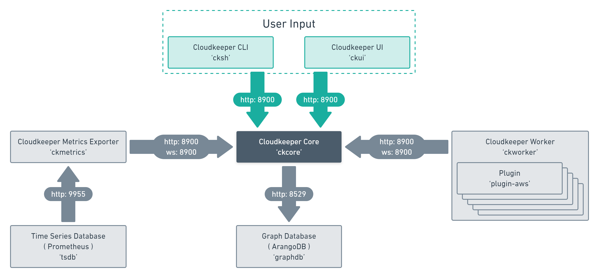

.. _component-list:

==========
Components
==========

These are the moving parts of Resoto.
We will now guide you through the setup and run procedure for each one.
:ref:`plugins` have no extra section, as they are integrated via :ref:`component-resotoworker`

- :ref:`component-resotocore`: the platform maintaining the `MultiDiGraph <https://en.wikipedia.org/wiki/Multigraph#Directed_multigraph_(edges_with_own_identity)>`_.
- :ref:`component-resotoshell`: the Resoto shell to interact with the core.
- :ref:`component-resotometrics` is a `Prometheus <https://prometheus.io/>`_ `exporter <https://prometheus.io/docs/instrumenting/exporters/>`_.
- :ref:`component-resotoworker` provides workers that load `plugins <https://github.com/someengineering/resoto/tree/main/plugins>`_ to perform collect and cleanup operations.
- :ref:`plugins` are a collection of worker plugins like `AWS <plugins/aws/>`_

To give you a better understanding of how Resoto's components interact with each other and where Prometheus and ArangoDB come in, we have prepared this visualization for you.

.. _component-resotocore:

resotocore
**********

The Resoto graph platform :ref:`component-resotocore` is the persistence and query backend of Resoto. It maintains the graph
of resources and provides APIs to update and access them. Within :ref:`component-resotocore` there are workflows consisting of steps
that result in actions like ``collect``, ``cleanup`` or ``generate_metrics``. These actions are being received by components
like :ref:`component-resotoworker` and :ref:`component-resotometrics`.

You can find more information in the section about :ref:`resotocore_spotlight`.

.. toctree::
   :maxdepth: 1
   :hidden:

   resotocore_spotlight

.. _component-resotoshell:

resotoshell
***********

resotoshell (``resh``) starts the Resoto shell. It is used to interact with :ref:`component-resotocore`.
It allows you to explore the graph, find resources of interest, mark them for cleanup, fix their tagging, aggregate over their metadata to create metrics and format the output for use in a 3rd party script or system.

.. _component-resotometrics:

resotometrics
*************

:ref:`component-resotometrics` takes :ref:`component-resotocore` graph data and runs aggregation functions on it.
Those aggregated metrics are then exposed in a :ref:`prometheus` compatible format.

.. _component-resotoworker:

resotoworker
************

:ref:`component-resotoworker` does all the collection and cleanup work in Resoto. It is connected to :ref:`component-resotocore` over a websocket connection and waits for instructions. By default it subscribes to the `collect` and `cleanup` actions as well as `tag` tasks.

:ref:`component-resotoworker` loads collector :ref:`plugins` like AWS, GCP, Slack, Onelogin, etc.
Only those plugins have knowledge about how to communicate with each cloud. How to collect resources and how to clean them up.

There can be one or more instances of :ref:`component-resotoworker` in a Resoto deployment. A single :ref:`component-resotoworker` can collect many clouds or you could have multiple :ref:`component-resotoworker` collecting one cloud or even one account in one cloud each.

Once :ref:`component-resotoworker` is started you do not have to interact with it at all. It will just sit there, wait for work and do its job.

| Most of the :ref:`actions <cleanup>` are done by :ref:`component-resotoworker` and :ref:`component-resotometrics`

.. _component-resotolib:

resotolib
*********

Any functionality that is required by more than one of our components will be put in :ref:`component-resotolib` library.

